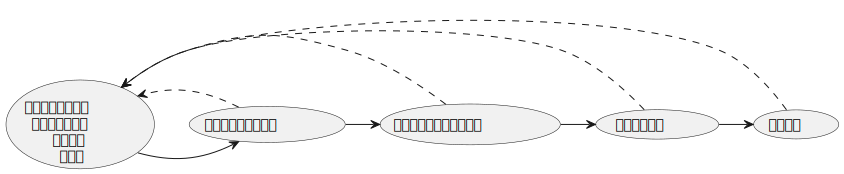

# 基本的な開発の流れ

この章では、Web開発の基本的な流れについて学びましょう。最初は工程が多く感じるかもしれませんが、一つずつ理解していけば、効率的で安全な開発ができるようになります。

## 学習目標

- モダンなWeb開発の作業の流れを理解する
- コードを書いてから公開するまでの工程を知る
- チームで効率的に開発する方法を学ぶ

## 現代のソフトウェア開発

- **変化の加速**: 技術革新や市場の需要は急速に変化しており予測可能性は低下
- **エコシステムの複雑化**: マイクロサービス、クラウド、モバイル、IoTなど、多様な技術が絡み合うことで、システム全体の複雑さは増加
- **利用者中心の要求**: ユーザーエクスペリエンスの重要性が高まり、迅速なフィードバックループを通じた継続的な改善が求められるように

## 開発の全体像

### 前提

これから紹介する一連の開発の流れはあくまで一例です。
実践の方法は現場によって異なります。そして最も大切な点はまず現実の問題に向き合い然るべき価値を提供するということです。

### 開発から公開までの流れ



### 開発者がやること

1. **計画**: どんな機能を作るか考える
2. **開発**: 実際にコードを書く
3. **テスト**: 正しく動くか確認する
4. **レビュー**: 他の人にコードを見てもらう
5. **公開**: ユーザーが使えるようにする

## 1. 計画：何を作るか決める

### Issue（課題）を作る

GitHubで「これを作りたい」「これを修正したい」という課題（Issue）を作ります。

```markdown
## やりたいこと

ユーザープロフィール画面を追加したい

## 詳細

- ユーザー名を表示
- アイコン画像を表示
- 自己紹介文を表示

## 確認事項

- [ ] デザインは決まっているか
- [ ] データはどこから取得するか
- [ ] 編集機能は必要か
```

### タスクを分解する

大きな機能は小さなタスクに分けると、進めやすくなります。

```
プロフィール画面の作成
  ├─ プロフィールページのUI作成
  ├─ ユーザーデータ取得API連携
  ├─ 画像アップロード機能
  └─ プロフィール編集機能
```

## 2. 開発：コードを書く

### ブランチを作る

まず、作業用のブランチを作ります。

```bash
# mainブランチから最新のコードを取得
git checkout main
git pull origin main

# 新しいブランチを作成
git checkout -b feature/user-profile
```

### コードを書く

開発を進めていきます。

```bash
# 開発サーバーを起動
pnpm run dev

# ブラウザで確認しながらコードを書く
# http://localhost:5173
```

### こまめに保存（コミット）する

```bash
# 変更したファイルを確認
git status

# 変更を追加
git add src/pages/Profile.tsx

# コミット（保存）
git commit -m "feat: add user profile page UI"
```

**コミットメッセージの書き方：**

```
feat: 新機能の追加
fix: バグ修正
docs: ドキュメント更新
style: コードの見た目の修正（動作は変わらない）
refactor: コードの整理
test: テストの追加・修正
```

## 3. テスト：動作確認する

### 手動テスト

実際にブラウザで動かして確認します。

```bash
# 開発サーバーで確認
pnpm run dev

# 本番環境に近い状態で確認
pnpm run build
pnpm run preview
```

**確認項目：**

- ✅ 画面が正しく表示されるか
- ✅ ボタンを押したら期待通りの動作をするか
- ✅ エラーが出ていないか
- ✅ スマホでも正しく表示されるか

### 自動テスト（慣れてきたら）

コードが正しく動くか、自動でチェックできます。

```bash
# テストを実行
pnpm run test

# 型チェック
pnpm run type-check

# コード品質チェック
pnpm run check
```

## 4. レビュー：見てもらう

### GitHubにプッシュする

```bash
# リモートにプッシュ
git push origin feature/user-profile
```

### Pull Requestを作る

GitHubでPull Request（PR）を作成します。

```markdown
## 変更内容

ユーザープロフィール画面を追加しました

## スクリーンショット

（画面のスクリーンショットを貼る）

## 確認方法

1. ログインする
2. 右上のアイコンをクリック
3. 「プロフィール」をクリック

## チェックリスト

- [x] 動作確認済み
- [x] テスト追加済み
- [x] ドキュメント更新済み
```

### レビューを受ける

チームメンバーがコードを確認してくれます。

**よくあるレビューコメント：**

- 「この部分、もっとシンプルに書けそう」
- 「エラー処理を追加した方がいいかも」
- 「変数名をもっとわかりやすくしよう」

### 修正する

レビューでの指摘を修正します。

```bash
# コードを修正

# 修正をコミット
git add .
git commit -m "fix: improve error handling"

# プッシュ
git push origin feature/user-profile
```

## 5. 公開：ユーザーに届ける

### マージする

レビューが承認されたら、mainブランチにマージします。

```bash
# GitHubのUIで「Merge Pull Request」ボタンをクリック
```

### 自動デプロイ

mainブランチにマージされると、自動的に公開されます（CI/CDが設定されている場合）。

```
GitHubにプッシュ
    ↓
自動でテスト実行
    ↓
テストが成功
    ↓
自動でビルド
    ↓
自動で公開（デプロイ）
    ↓
ユーザーが使える！
```

## よくある開発パターン

### パターン1：小さな修正

```bash
# ブランチ作成
git switch -c fix/button-color

# 修正
# (コードを修正)

# コミット・プッシュ
git add .
git commit -m "fix: change button color to blue"
git push origin fix/button-color

# PR作成 → レビュー → マージ
```

### パターン2：新機能の追加

```bash
# Issue作成（GitHubで）

# ブランチ作成
git switch -c feature/search-function

# 開発
# (複数回コミット)
git commit -m "feat: add search UI"
git commit -m "feat: add search API"
git commit -m "test: add search tests"

# テスト実行
pnpm run test
pnpm run check

# プッシュ
git push origin feature/search-function

# PR作成 → レビュー → 修正 → マージ
```

## チーム開発のルール

### 1. mainブランチは常に動く状態にする

- mainブランチに直接コミットしない
- 必ずブランチを作って作業する
- PRでレビューを受けてからマージ

### 2. わかりやすいコミットメッセージを書く

**良い例：**

```bash
git commit -m "feat: add user login functionality"
git commit -m "fix: resolve profile image upload error"
```

**悪い例：**

```bash
git commit -m "update"
git commit -m "fix bug"
```

### 3. 小さく分けて、こまめにコミット

**良い例：**

```bash
git commit -m "feat: add login form UI"
git commit -m "feat: add login validation"
git commit -m "feat: add login API integration"
```

**悪い例：**

```bash
# 1週間分の変更を一度にコミット
git commit -m "add login feature"
```

### 4. PRは早めに作る

- 完成してからPRを作るのではなく
- 早めに作って「Draft PR」として共有
- 途中でも見てもらえる

## 便利なツール

### 開発を助けるツール

| ツール     | 用途                 | コマンド例            |
| ---------- | -------------------- | --------------------- |
| Vite       | 開発サーバー・ビルド | `pnpm run dev`        |
| Biome      | コード品質チェック   | `pnpm run check`      |
| TypeScript | 型チェック           | `pnpm run type-check` |
| Vitest     | テスト実行           | `pnpm run test`       |
| Git        | バージョン管理       | `git status`          |

### よく使うコマンド

```bash
# 開発開始
pnpm run dev

# コード品質チェック
pnpm run check

# 自動修正
pnpm run check:fix

# テスト実行
pnpm run test

# ビルド
pnpm run build
```

## トラブルシューティング

### 1. コミットできない

```bash
# エラー: コード品質チェックで失敗

# 自動修正を試す
pnpm run check:fix

# それでもダメなら、エラー内容を確認して手動で修正
pnpm run check
```

### 2. ブランチを間違えた

```bash
# 現在のブランチを確認
git branch

# 正しいブランチに切り替え
git switch feature/correct-branch

# ブランチを作り直す場合
git switch main
git switch -c feature/new-branch
```

### 3. コンフリクトが起きた

```bash
# mainの最新を取得
git checkout main
git pull origin main

# 自分のブランチに戻る
git checkout feature/my-branch

# mainの変更を取り込む
git merge main

# コンフリクトを解消（ファイルを手動で編集）
# <<<<<<< HEAD と >>>>>>> の部分を修正

# 解消後、コミット
git add .
git commit -m "merge: resolve conflicts with main"
```

## ポイント

この章で学んだことをまとめます。

**開発の流れ：**

1. **計画**: Issueで何を作るか決める
2. **開発**: ブランチを作ってコードを書く
3. **テスト**: 動作確認とコード品質チェック
4. **レビュー**: PRを作ってチームに見てもらう
5. **公開**: マージして自動デプロイ

**大切なこと：**

- ✅ mainブランチは常に動く状態を保つ
- ✅ 小さく分けて、こまめにコミット
- ✅ わかりやすいメッセージを書く
- ✅ 早めにPRを作って相談する
- ✅ レビューは学びの機会

**使うツール：**

- **Git**: バージョン管理
- **GitHub**: コード共有・レビュー
- **Vite**: 開発サーバー
- **Biome**: コード品質チェック
- **TypeScript**: 型チェック

最初は覚えることが多くて大変かもしれませんが、この流れに慣れると、安全で効率的な開発ができるようになります。チームで協力しながら、少しずつ慣れていきましょう！
