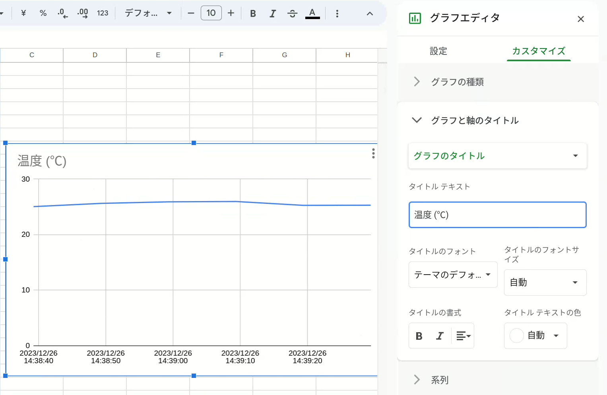
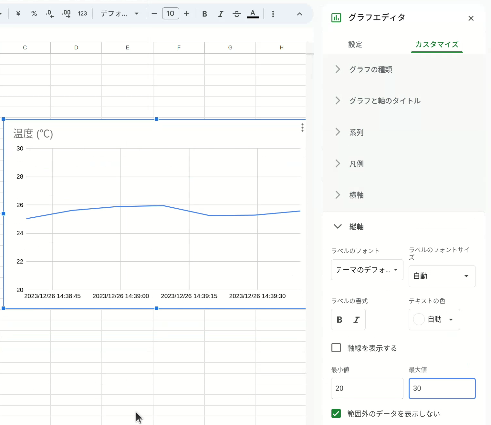
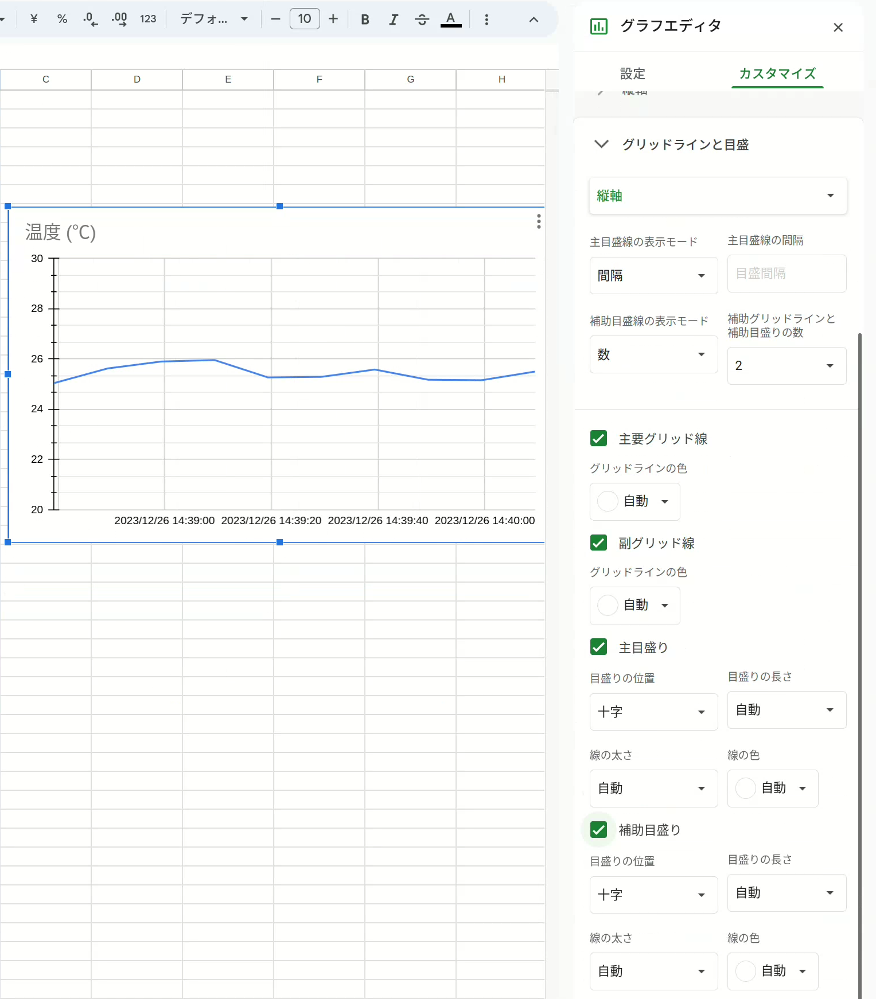
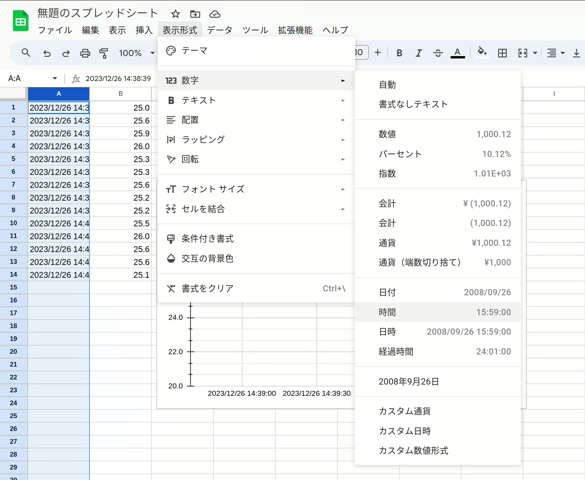

# グラフの作成

Googleスプレッドシートでグラフを作成します。

> <video controls autoplay loop><source type="video/webm" src="insert-chart.webm" /></video>

1. グラフの列を選択します
1. [挿入] > [グラフ] を選択します

## グラフのタイトル

グラフの見た目を変更する方法をいくつか紹介します。

> 

1. 変更するグラフをダブルクリックします
1. 右側の [カスタマイズ] を選択します
1. [グラフと軸のタイトル] を選択します
1. [グラフのタイトル] > タイトルテキストを入力します

## 縦軸の範囲の変更

> 

縦軸の表示範囲は [縦軸] > [最小値]/[最大値] を入力します。

## 目盛り

> 

目盛りの追加は [グリッドラインと目盛] > [主目盛り]/[補助目盛り] を選択します。

## 表示形式

> 

1. グラフの列を選択します
1. [表示形式] メニューから表示形式を選択します

## 参考文献

- [グラフを追加、編集する - パソコン - Google ドキュメント エディタ ヘルプ](https://support.google.com/docs/answer/63824)
- [Google スプレッドシートのグラフの種類 - Google ドキュメント エディタ ヘルプ](https://support.google.com/docs/answer/190718?hl=ja)
