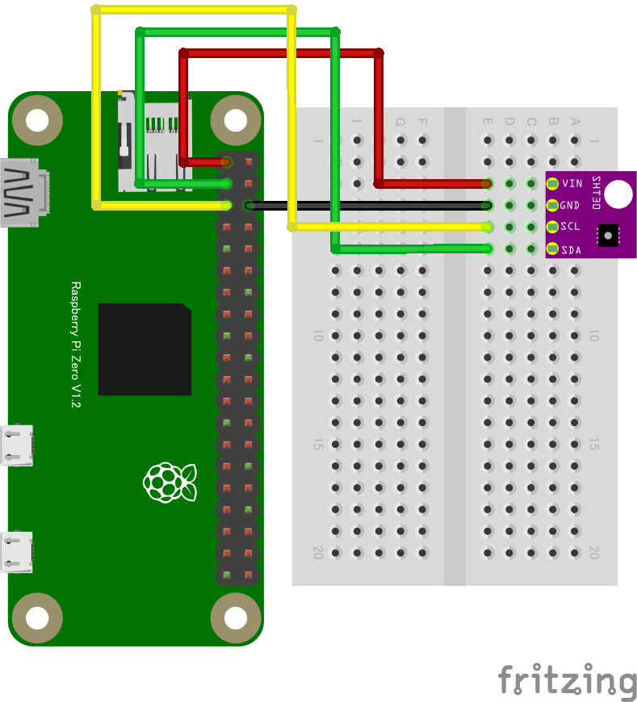

# 温度センサーのデータの送信

それではRaspberry Piからスプレッドシートにデータを送信してみましょう。

温度センサー SHT30 を利用して温度のデータを送信します。

## 事前準備



- Raspberry Pi
- SHT30 (温度・湿度センサ)
- 配線用のワイヤー

## サンプルコード

次のようなNode.jsのコードを実行することでデータを送信します:

```js
// ここはWebアプリのURLに書き換えます
const endpoint = "https://script.google.com/{SCRIPTID}/exec";

import { requestI2CAccess } from "node-web-i2c";
import SHT30 from "@chirimen/sht30";

const sleep = (ms) => new Promise((resolve) => setTimeout(resolve, ms));

const i2cAccess = await requestI2CAccess();
const port = i2cAccess.ports.get(1);
const sht30 = new SHT30(port, 0x44);
await sht30.init();

while (true) {
  const { humidity, temperature } = await sht30.readData();
  const row = [temperature];

  await fetch(endpoint, { method: "POST", body: JSON.stringify(row) });

  const message = `現在の温度は${temperature.toFixed(2)}度です`;

  console.log(endpoint, message);

  // 10秒待機
  await sleep(10000); // ms
}
```

スプレッドシートに温度センサーのデータが記録されていることを確認してみましょう。
