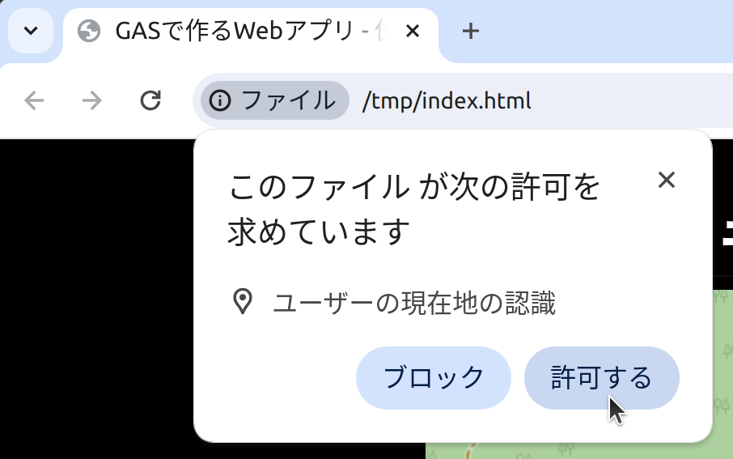

# 地図上に位置を表示する

地図を表示するためのサードパーティAPI (Leaflet) を使用し、地図上に位置を表示します。

## 書式

地図:

```html
<link rel="stylesheet" href="https://unpkg.com/leaflet/dist/leaflet.css" />
<script src="https://unpkg.com/leaflet"></script>
<script type="module">
  const map = L.map("map").setView([36, 138], 15);

  // OpenStreetMapのデータはOpen Database Licenseのもとに利用を許諾されています。
  L.tileLayer("https://tile.openstreetmap.org/{z}/{x}/{y}.png", {
    attribution: `&copy; <a href="https://www.openstreetmap.org/copyright">OpenStreetMap</a> contributors`,
  }).addTo(map);
</script>
<h1>位置情報メモ</h1>
<div id="map" style="width: 500px; height: 500px"></div>
```

- [Leaflet - a JavaScript library for interactive maps](https://leafletjs.com/)

現在地の取得:

```js
async function getLatLng() {
  const position = await new Promise((resolve, reject) =>
    navigator.geolocation.getCurrentPosition(resolve, reject),
  );

  return [position.coords.latitude, position.coords.longitude];
}

// [<緯度>, <経度>]
const here = await getLatLng();
```

- [位置情報 API - Web API | MDN](https://developer.mozilla.org/ja/docs/Web/API/Geolocation_API)

丸いマーカーの表示:

```js
L.circleMarker([<緯度>, <経度>]).addTo(map);
```

地図の移動:

```js
map.flyTo([<緯度>, <経度>]);
```

## サンプルコード (全体)

```html
<!doctype html>
<meta charset="UTF-8" />
<title>GASで作るWebアプリ - 位置情報メモ</title>
<link rel="stylesheet" href="https://unpkg.com/leaflet/dist/leaflet.css" />
<script src="https://unpkg.com/leaflet"></script>
<script type="module">
  /** 経緯度の取得 */
  async function getLatLng() {
    const position = await new Promise((resolve, reject) =>
      navigator.geolocation.getCurrentPosition(resolve, reject),
    );

    return [position.coords.latitude, position.coords.longitude];
  }

  const map = L.map("map").setView([36, 138], 15);

  // OpenStreetMapのデータはOpen Database Licenseのもとに利用を許諾されています。
  L.tileLayer("https://tile.openstreetmap.org/{z}/{x}/{y}.png", {
    attribution: `&copy; <a href="https://www.openstreetmap.org/copyright">OpenStreetMap</a> contributors`,
  }).addTo(map);

  // 現在地
  const here = await getLatLng();
  // 現在地にマーカーを表示
  L.circleMarker(here).addTo(map);
  // 現在地に移動
  map.flyTo(here);
</script>

<h1>位置情報メモ</h1>
<div id="map" style="width: 500px; height: 500px"></div>
```

> **Note**\
> `[36, 138]`は日本の地理的中心、北緯36度東経138度、長野県<ruby>上伊那郡<rt>かみいなぐん</rt></ruby><ruby>辰野町<rt>たつのまち</rt></ruby>の区有林。
>
> - [日本の地理的中心 ゼロポイント](https://www.town.tatsuno.lg.jp/gyosei/soshiki/sangyoshinkoka/kankosite/4/7/1175.html)

位置情報API (Geolocation API) を使用すると、自分の位置情報をWebアプリから取得することができます。
位置情報APIの初回使用時には、位置情報の許可を求められるので[許可]を選択します。

> 

位置情報が地図上に表示されることを確認してみましょう。
