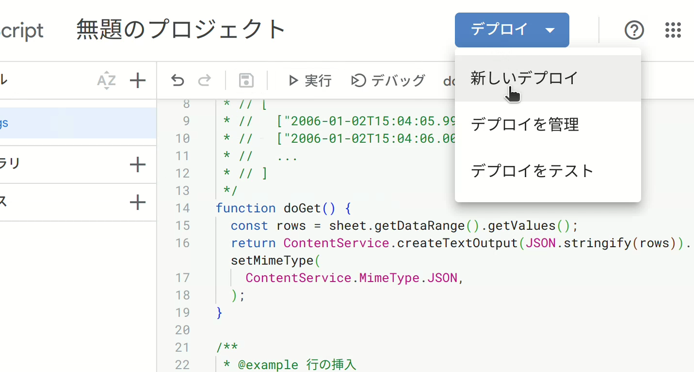
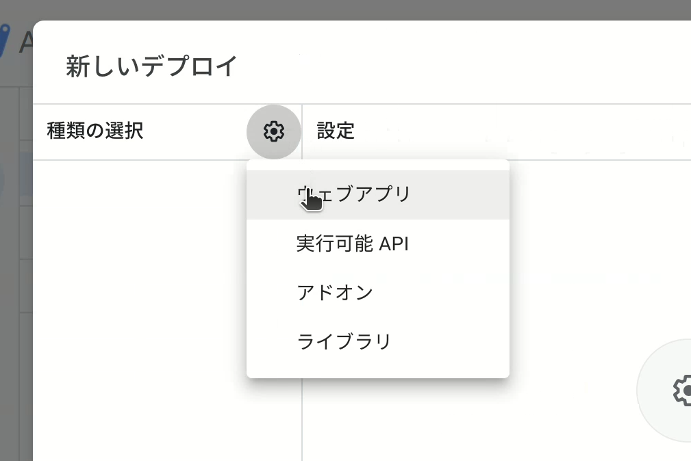
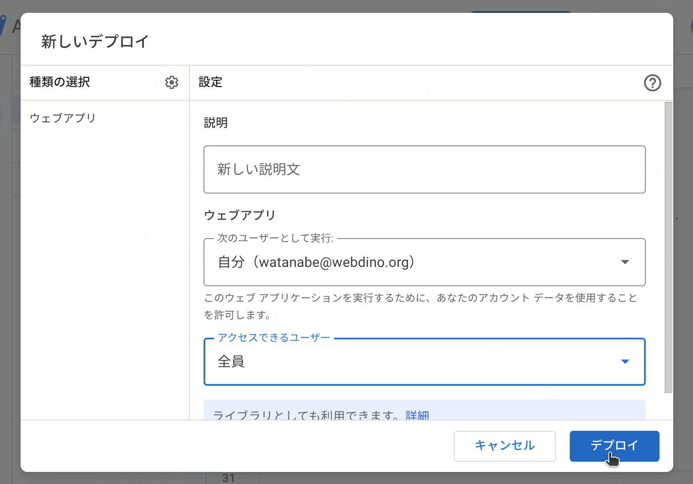
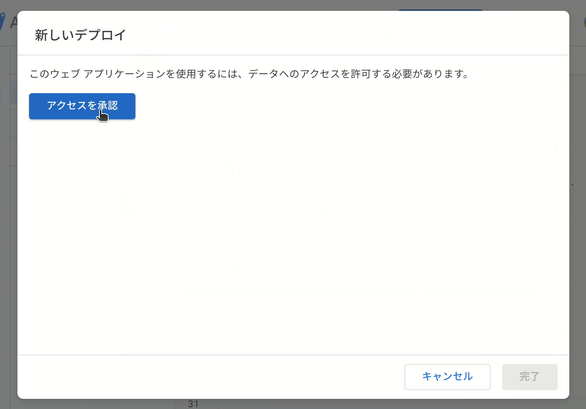
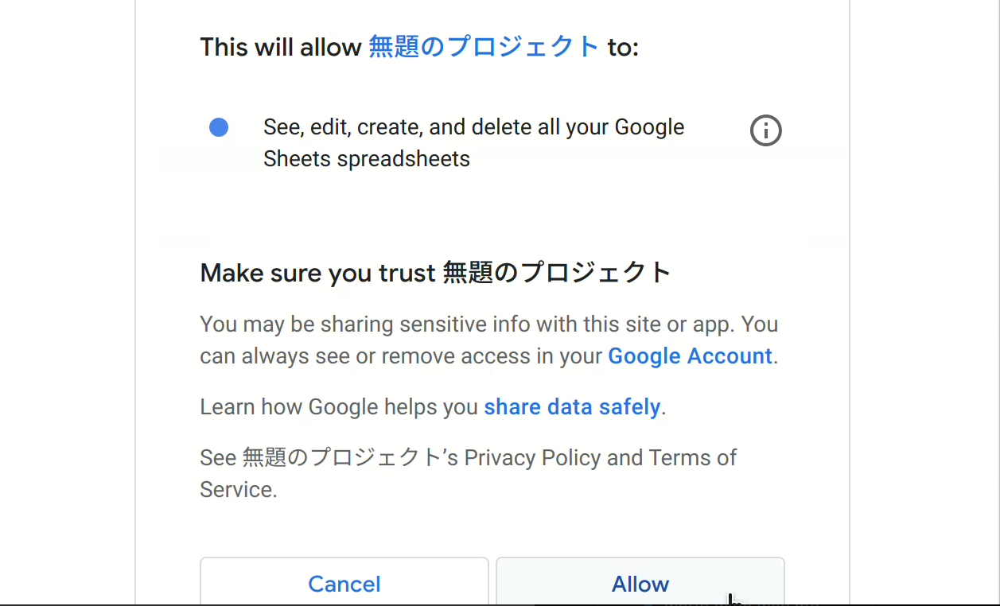
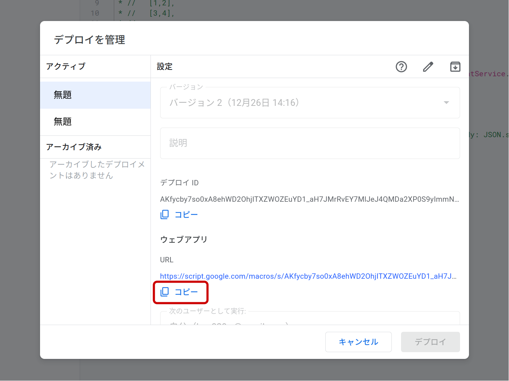

# スプレッドシートの作成

Googleスプレッドシートを作成し、Google Apps Scriptのプロジェクトを作成します。

> <video controls autoplay loop><source type="video/webm" src="create-project.webm" /></video>

## 事前準備

- Googleアカウント

## スプレッドシートの作成

<https://sheet.new> にアクセス、または「[スプレッドシートのホーム画面](https://sheets.google.com/)」を開き、+をクリックします。

_参考: [Google スプレッドシートの使い方 - パソコン - Google ドキュメント エディタ ヘルプ](https://support.google.com/docs/answer/6000292)_

## プロジェクトの作成

[拡張機能] > [Apps Script] を選択し、Google Apps Scriptのプロジェクトを作成します。

以下のコードをコピーして貼り付け、💾 [プロジェクトを保存] します。

```js
// 最初のシート
const [sheet] = SpreadsheetApp.getActiveSpreadsheet().getSheets();

/**
 * @example 行全体の取得
 * const res = await fetch("https://script.google.com/{SCRIPTID}/exec");
 * const rows = await res.json();
 * // [
 * //   ["2006-01-02T15:04:05.999Z",1,2],
 * //   ["2006-01-02T15:04:06.000Z",3,4],
 * //   ...
 * // ]
 */
function doGet() {
  const rows = sheet.getDataRange().getValues().slice(1);
  return ContentService.createTextOutput(JSON.stringify(rows)).setMimeType(
    ContentService.MimeType.JSON,
  );
}

/**
 * @example 行の挿入
 * const row = [5,6];
 * await fetch("https://script.google.com/{SCRIPTID}/exec", { method: "POST", body: JSON.stringify(row) })
 */
function doPost(e) {
  const row = JSON.parse(e.postData.contents);
  sheet.appendRow([new Date(), ...row]);
  return doGet();
}
```

プロジェクトを保存できたら、そのプロジェクトを<ruby>利用可能に<rt>デプロイ</rt></ruby>します。

## プロジェクトのデプロイ

プロジェクトを新しくデプロイするには [デプロイ] > [新しいデプロイ] から行います。

> 

[種類の選択] ⚙ > [ウェブアプリ] を選択します。





[アクセスできるユーザー] > [全員] を選択し、[デプロイ] を選択します。



Googleアカウントへのアクセス許可を求められるのでアカウントを選択し、<ruby>[Allow]<rt>許可</rt></ruby> をクリックします

> 

WebアプリのURLが表示されればデプロイ完了です。



データの送信にはこのWebアプリのURL (`https://script.google.com/macros/s/AKf...`) を使用します。

このURLはコピーしておきましょう。

## 使用方法

データの取得:

```js
// ここはWebアプリのURLに書き換えます
const endpoint = "https://script.google.com/{SCRIPTID}/exec";
const res = await fetch(endpoint);
const [timestamp, ...rows] = await res.json();
```

データの送信:

```js
// ここはWebアプリのURLに書き換えます
const endpoint = "https://script.google.com/{SCRIPTID}/exec";
const row = [...<送信する内容>...];

await fetch(endpoint, { method: "POST", body: JSON.stringify(row) });
```

WebアプリのURLと送信する内容の部分は適宜変更して使用します。

## 送信してみよう！

サンプルコード:

```js
const row = [42];
await fetch(endpoint, { method: "POST", body: JSON.stringify(row) });
```

`endpoint =`

<form onsubmit="(e) => e.preventDefault(),
  fetch(new FormData(this).get(`endpoint`), {
    method: `POST`,
    body: JSON.stringify([42]),
  })
    .then((r) => (document.querySelector(`.result`).textContent = `HTTP/2 ${r.status}\n\n`,r))
    .then((r) => r.json())
    .then((j) => document.querySelector(`.result`).textContent += JSON.stringify(j, null, 2));
">
<input type="url" name="endpoint" required placeholder="https://script.google.com/{SCRIPTID}/exec … WebアプリのURL" autocomplete="off" style="width: 80%; padding: 4px" />
<input type="submit" value="実行" />
</form>

レスポンス:

<pre><code class="result language-http">null</code></pre>
