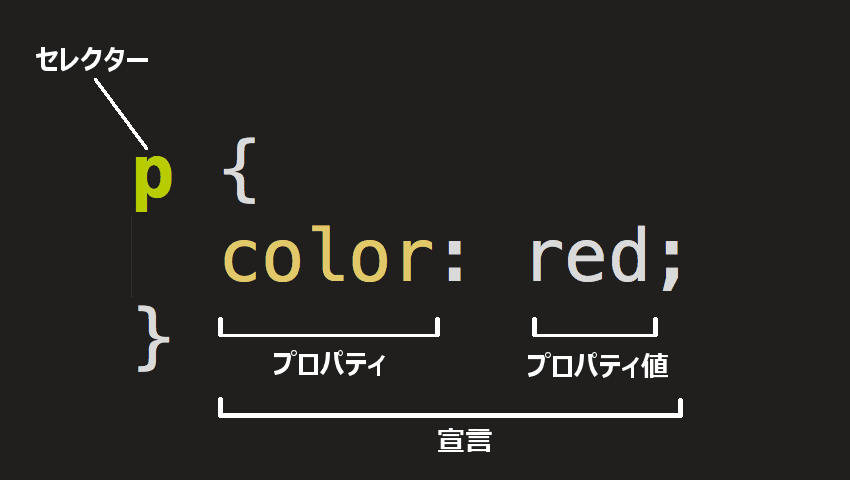
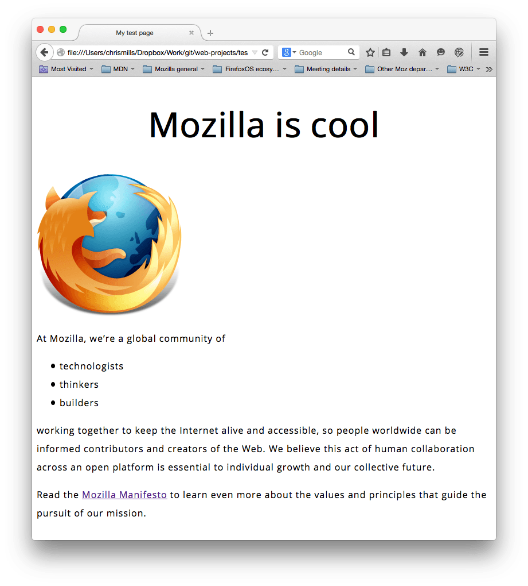

> ― この文書は © 2023 [MDN Web Docsプロジェクト協力者](https://developer.mozilla.org/ja/docs/MDN/Community/Roles_teams#%E5%8D%94%E5%8A%9B%E8%80%85) クリエイティブ・コモンズ [CC BY SA 2.5](https://github.com/mdn/translated-content/blob/main/LICENSE.md) ライセンスのもとに利用を許諾されています。
> 元の文書: <https://developer.mozilla.org/ja/docs/Learn/Getting_started_with_the_web/CSS_basics>

# CSSの基本

CSS (Cascading Style Sheets) は、Webページのスタイルを設定するコードです。ここでは、始めるのに必要なものを紹介します。ここでは、テキストを赤くするにはどうすればいいのか？コンテンツを（Webページの）レイアウトの中で特定の場所に表示するにはどうすればいいのか？背景画像と色を使って Webページをどのように飾るのか？というような疑問に答えていきます。

例えば、この CSS は段落のテキストを選択し、色を赤に設定しています。

```css
p {
  color: red;
}
```

それでは試してみましょう。テキストエディターを使用して、（上記の） 3 行の CSS 新しいファイルに貼り付けてください。そのファイルを `style.css` として `styles` という名前のディレクトリーに保存してください。

コードを働かせるには、この（上記の） CSS を HTML 文書に適用する必要があります。そうしないと、このスタイルはブラウザーの HTML 文書の表示に影響しません。

1. `index.html` ファイルを開き、先頭（{{HTMLElement("head")}} タグと `</head>` タグの間）に以下の行を貼り付けてください。

   ```html
   <link href="styles/style.css" rel="stylesheet" />
   ```

2. `index.html` を保存し、ブラウザーで読み込んでください。次のように表示されるはずです。

段落のテキストが赤くなっていれば、おめでとう！ CSS が動作しています。

### CSS ルールセットの構造

赤い段落テキストの CSS コードを分解して、その仕組みを理解してみましょう。



全体の構造は**ルールセット**と呼びます (*ルールセット*という語はよく、単に*ルール*とも呼ばれます)。それぞれの部分の名前にも注意してください。

- セレクター (Selector)
  - : これはルールセットの先頭にある HTML 要素名です。これはスタイルを設定する要素 (この例の場合は {{HTMLElement("p")}} 要素) を定義します。別の要素をスタイル付けするには、セレクターを変更してください。
- 宣言 (Declaration)
  - : `color: red;` のような単一のルールです。これは要素の**プロパティ**のうち、スタイル付けしたいものを指定します。
- プロパティ (Property)
  - : これらは、 HTML 要素をスタイル付けするための方法です。 (この例では、 `color` は {{htmlelement("p")}} 要素のプロパティです。) CSS では、ルールの中で影響を与えたいプロパティを選択します。
- プロパティ値 (Property value)
  - : プロパティの右側には—コロンの後に—**プロパティ値**があります。与えられたプロパティの多くの外観から 1 つを選択します。 (例えば、 `color` の値は `red` 以外にもたくさんあります。)

構文の他の重要な部分に注意してください。

- セレクターを除き、それぞれのルールセットは中括弧 (`{}`) で囲む必要があります。
- それぞれの宣言内では、コロン (`:`) を使用してプロパティと値を分離する必要があります。
- それぞれのルールセット内でセミコロン (`;`) を使用して、それぞれの宣言と次のルールを区切る必要があります。

一つのルールセットで複数のプロパティ値を変更するには、次のようにセミコロンで区切って書いてください。

```css
p {
  color: red;
  width: 500px;
  border: 1px solid black;
}
```

### 複数の要素の選択

複数の要素を選択して、そのすべてに一つのルールセットを適用することもできます。複数のセレクターはカンマで区切ります。たとえば、以下のようになります。

```css
p,
li,
h1 {
  color: red;
}
```

### さまざまな種類のセレクター

セレクターにはさまざまな種類があります。上記の例では、**要素セレクター**を使用しており、特定の種類の要素をすべて選択しています。しかし、もっと特定の要素を選択することもできます。ここでは、より一般的なセレクターの種類を紹介します。

<table class="standard-table no-markdown">
  <thead>
    <tr>
      <th scope="col">セレクター名</th>
      <th scope="col">選択するもの</th>
      <th scope="col">例</th>
    </tr>
  </thead>
  <tbody>
    <tr>
      <td>要素セレクター（タグまたは型セレクターと呼ばれることもあります）</td>
      <td>指定された型のすべての HTML 要素。</td>
      <td><code>p</code><br /><code>&#x3C;p></code> を選択</td>
    </tr>
    <tr>
      <td>ID セレクター</td>
      <td>
        指定された ID を持つページ上の要素です。指定された HTML ページでは、各 id 値は一意でなければなりません。
      </td>
      <td>
        <code>#my-id</code><br /><code>&#x3C;p id="my-id"></code> または
        <code>&#x3C;a id="my-id"></code> を選択
      </td>
    </tr>
    <tr>
      <td>クラスセレクター</td>
      <td>
        指定されたクラスを持つページ上の要素です。同じクラスの複数のインスタンスが 1 つのページに現れることがあります。
      </td>
      <td>
        <code>.my-class</code><br />
        <code>&#x3C;p class="my-class"></code> および
        <code>&#x3C;a class="my-class"></code> を選択
      </td>
    </tr>
    <tr>
      <td>属性セレクター</td>
      <td>指定された属性を持つページ上の要素です。</td>
      <td>
        <code>img[src]</code><br />
        <code>&#x3C;img src="myimage.png"></code> は選択するが
        <code>&#x3C;img></code> は選択しない
      </td>
    </tr>
    <tr>
      <td>擬似クラスセレクター</td>
      <td>
        指定された要素が指定された状態にあるとき。（例えば、マウスポインターが上に乗っている（ホバー）状態。）
      </td>
      <td>
        <code>a:hover</code><br /><code>&#x3C;a></code> を、マウスポインターがリンク上にあるときのみ選択。
      </td>
    </tr>
  </tbody>
</table>

他にも様々なセレクターがあります。詳しくは、 MDN の[セレクターガイド](https://developer.mozilla.org/ja/docs/Learn/CSS/Building_blocks/Selectors)をご覧ください。

## フォントとテキスト

CSS の基本をいくつか勉強しましたので、`style.css` ファイルにいくつかのルールと情報を追加して、この例を見栄え良くしましょう。

1. まず、以前に[Webサイトをどんな外見にするか](https://developer.mozilla.org/ja/docs/Learn/Getting_started_with_the_web/What_will_your_website_look_like)で保存した、 [Google フォントの出力](https://developer.mozilla.org/ja/docs/Learn/Getting_started_with_the_web/What_will_your_website_look_like#font)を探します。 {{htmlelement("link")}} 要素を `index.html` の先頭のどこか（{{HTMLElement("head")}} タグと `</head>` タグの間）に追加します。それは次のようなものです。

   ```html
   <link
     href="https://fonts.googleapis.com/css?family=Open+Sans"
     rel="stylesheet"
   />
   ```

   このコードは、Webページに Open Sans フォントファミリーを読み込むスタイルシートにページをリンクします。

2. 次に `style.css` ファイルにある既存のルールを削除します。試験としては良いものでしたが、赤いテキストだらけにするのはもうやめましょう。
3. 以下の行（下記参照）を追加し、 `font-family` の割り当てを[Webサイトをどんな外見にするか](https://developer.mozilla.org/ja/docs/Learn/Getting_started_with_the_web/What_will_your_website_look_like)で選択した `font-family` に置き換えます。 `font-family` というプロパティは、テキストに使用するフォントを指します。このルールでは、ページ全体の基本フォントとフォントの大きさを定義します。 {{HTMLElement("html")}} はページ全体の親要素なので、その中のすべての要素は同じ `font-size` と `font-family` を継承します。

   ```css
   html {
     font-size: 10px; /* px は「ピクセル」 (pixels) の意味。ベースフォントサイズは 10 ピクセルの高さになった */
     font-family: "Open Sans", sans-serif; /* これが Google フォントから取得した残りの出力になるはず。 */
   }
   ```

   > **Note** CSS の `/*` と `*/` の間にあるものは何でも **CSS コメント**になります。ブラウザーはコードをレンダリングするときにこれを無視します。 CSS コメントはコードや論理について役立つメモを書くための方法です。

4. 次に、 HTML 本文内にテキストを配置する要素 ({{htmlelement("Heading_Elements", "h1")}}, {{htmlelement("li")}}, {{htmlelement("p")}}) のフォントの大きさを設定します。また、見出しを中央揃えにします。最後に、 2 つ目のルールセット (下記) を展開して、行の高さや文字の間隔などの設定を行い、本文のコンテンツを読みやすくしましょう。

   ```css
   h1 {
     font-size: 60px;
     text-align: center;
   }

   p,
   li {
     font-size: 16px;
     line-height: 2;
     letter-spacing: 1px;
   }
   ```

`px` の値はお好みで調整してください。進行中の作品は、このようになるはずです。



## CSS: ボックスのすべて

CSS を書いていて気づくことがあります。それは、その多くがボックスに関するものだということです。これには、サイズ、色、位置の設定が含まれます。ページ上のほとんどの HTML 要素は、他の箱の上に置かれた箱と考えることができます。


Photo from [https://www.geograph.org.uk/photo/3418115](https://www.geograph.org.uk/photo/3418115) Copyright © [Jim Barton](https://www.geograph.org.uk/profile/26362) [cc-by-sa/2.0](https://creativecommons.org/licenses/by-sa/2.0/)

CSS のレイアウトは、主に*ボックスモデル*に基づいています。ページ上のスペースを占める各ボックスには、次のようなプロパティがあります。

- `padding`: コンテンツの周囲のスペースです。以下の例では、段落テキストの周りのスペースです。
- `border`: `padding` のすぐ外側にある実線
- `margin`: 要素の外側の周りの空間


この節では次のものを使用します。

- `width` (要素の)
- `background-color`: 要素の内容と padding の背後にある色
- `color`: 要素のコンテンツ (通常はテキスト) の色
- `text-shadow`: 要素内のテキストに影を設定します
- `display`: 要素の表示モードを設定します (これについてはまだ心配しないでください)

続けて、さらに CSS を追加していきましょう。 `style.css` の一番下に、これらの新しいルールを追加し続けます。値を変えてどうなるか実験してみましょう。

### ページの色を変更する

```css
html {
  background-color: #00539f;
}
```

このルールはページ全体の背景色に設定を行います。上記のカラーコードを、[Webサイトをどんな外見にするかで選んだ色](https://developer.mozilla.org/ja/docs/Learn/Getting_started_with_the_web/What_will_your_website_look_like#テーマカラー)に変更しましょう。

### 本文のスタイル付け

```css
body {
  width: 600px;
  margin: 0 auto;
  background-color: #ff9500;
  padding: 0 20px 20px 20px;
  border: 5px solid black;
}
```

次は {{htmlelement("body")}} 要素です。ここにはいくつかの宣言がありますので、 1 行ずつ見て行きましょう。

- `width: 600px;` — これにより body は常に 600 ピクセルの幅になります。
- `margin: 0 auto;` — `margin` や `padding` などのプロパティに 2 つの値を設定すると、最初の値は要素の上下の辺に影響します（この場合は `0` になります）。2 番目の値は左右に影響します（ここで `auto` は残った水平方向の余白を左右に均等に配分する特別な値です）。 [margin の構文](https://developer.mozilla.org/ja/docs/Web/CSS/margin#syntax)で説明しているように、 1 つ、2 つ、3 つ、4 つの値を使用することもできます。
- `background-color: #FF9500;` — これは要素の背景色を設定します。このプロジェクトでは body の背景色に明るいオレンジ色を使用して、 {{htmlelement("html")}} 要素の暗い青とは対照的にしました。（気軽に試してみてください。）
- `padding: 0 20px 20px 20px;` — これはパディングに 4 つの値を設定します。これは、コンテンツの周りに少しのスペースを確保するためです。今回は body の上にパディングを設定せず、左・下・右に 20 ピクセルを設定します。値は上・右・下・左の順に設定されます。`margin` と同様、 [padding の構文](https://developer.mozilla.org/ja/docs/Web/CSS/padding#syntax)で説明されているように、 1 つ、 2 つ、または 3 つの値を使用することもできます。
- `border: 5px solid black;` — これは境界の太さ、スタイル、色の値を設定します。この場合は、 body の全側面に 5 ピクセルの太さの黒ベタの境界線を設定します。

### メインページのタイトルの配置とスタイル付け

```css
h1 {
  margin: 0;
  padding: 20px 0;
  color: #00539f;
  text-shadow: 3px 3px 1px black;
}
```

body の上部にひどい隙間があることに気づいたかもしれません。これは CSS をまったく適用していなくても、ブラウザーが（他のものの中で） {{htmlelement("Heading_Elements", "h1")}} 要素に既定のスタイルを適用するためです。それは悪い考えのように見えるかもしれませんが、スタイルのないページにも一定の読みやすさを求めるためのものです。隙間をなくすために、 `margin: 0;` を設定して既定のスタイルを上書きします。

次に見出しの上下のパディングを 20 ピクセルに設定します。

続いて、見出しテキストが HTML の背景色と同じ色になるように設定します。

最後に、 `text-shadow` は要素のテキストコンテンツに影を適用します。 4 つの値は次のとおりです。

- 最初はピクセル値で、影のテキストからの**水平オフセット**、どれだけ横に移動するかを設定します。
- 2 番目はピクセル値で、影のテキストから**垂直オフセット**、どれだけ下に移動するかを設定します。
- 3 番目のピクセル値で、影を**ぼかす半径**を設定します。値が大きいほどぼやけた影を生成します。
- 4 番目の値は、影の基本色を設定します。

いろいろな値を試して、表示方法の変化を確認してみてください。

### 画像のセンタリング

```css
img {
  display: block;
  margin: 0 auto;
}
```

次に、画像を中央に配置して見栄えを良くします。本文のときと同じように、 `margin: 0 auto` のトリックを使うこともできます。しかし、 CSS を機能させるために追加の設定が必要になる違いがあります。

{{htmlelement("body")}} は**ブロック**要素であるため、ページの中でスペースを占めます。ブロック要素は、マージンやその他の余白を開ける値を適用することができます。一方、画像は**インライン**要素です。インライン要素にマージンやその他の余白を開ける値を適用することはできません。画像にマージンを適用するには、`display: block;` を使用して画像にブロックレベルの動作を指定する必要があります。

> **Note** 上記の手順は、本体に設定されている幅 (600 ピクセル) よりも小さい画像を使用していることを前提としています。画像が大きい場合、それは本文をあふれ、ページの残りの部分にはみ出します。これを修正するには、1) [画像編集ソフト](https://ja.wikipedia.org/wiki/%E3%83%9A%E3%82%A4%E3%83%B3%E3%83%88%E3%82%BD%E3%83%95%E3%83%88)を使用して画像の幅を縮小するか、2) CSS を使用して、 {{cssxref("width")}} プロパティでより小さな値を `` 要素に設定し、画像の大きさを変更します。

> **Note** `display: block;` や、ブロックレベル/インラインの区別がまだ理解できなくても心配しないでください。 CSS の勉強を続けていくうちに意味が分かってくるはずです。さまざまな display の値の違いについて詳しくは、 MDN の [display のリファレンスページ](https://developer.mozilla.org/ja/docs/Web/CSS/display)を参照してください。

## まとめ

完成すると次のようなページが表示されます。


[作成した結果はこちらから見ることができます](https://mdn.github.io/beginner-html-site-styled/)。

もしよく分からなくなったときは[サンプルコード](https://github.com/mdn/beginner-html-site-styled/blob/gh-pages/styles/style.css)と見比べてみましょう。
