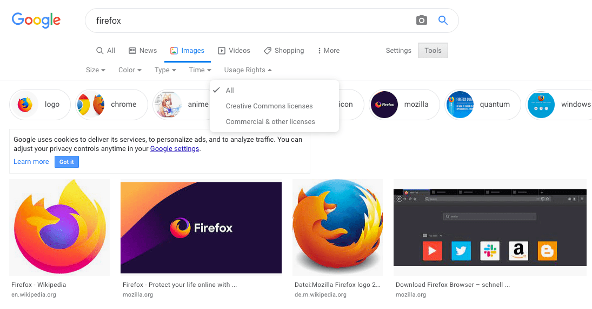

> ― この文書は © 2023 [MDN Web Docsプロジェクト協力者](https://developer.mozilla.org/ja/docs/MDN/Community/Roles_teams#%E5%8D%94%E5%8A%9B%E8%80%85) クリエイティブ・コモンズ [CC BY SA 2.5](https://github.com/mdn/translated-content/blob/main/LICENSE.md) ライセンスのもとに利用を許諾されています。
> 元の文書: <https://developer.mozilla.org/ja/docs/Learn/Getting_started_with_the_web/What_will_your_website_look_like>

# Web開発入門

Web開発を始める前に考えておかなければいけないことがあります。Webサイトは様々なことができます。しかし複雑なものを開発するとしても、はじめはできるだけ単純なものから少しずつ理解を深めていくべきでしょう。

まずは、見出し、画像、段落のある単純なWebページを作ることから始めましょう。

1. **何についてのWebページ？** 犬、ニューヨーク、それともパックマン？
2. **どんな情報？** タイトルといくつかの段落、それからページに表示させたい画像を考えます。
3. **どんな見た目？** 簡単で大まかな言葉で言うと？背景色は？適切なフォントはフォーマル？漫画？太字で派手？繊細？

## デザインをスケッチする

次に、ペンと紙を取ってサイトの見た目をどういう風にしたいのか大まかに描き出します。はじめてのシンプルなWebページでは、描き出すものもあまりないかもしれませんが、作る上での習慣にしましょう。(ヴァン・ゴッホのようになる必要はありません)

> **Note** 現実の複雑なWebサイトの場合でも、デザインチームは普通、ラフスケッチを描くことから始めます。その後、グラフィックエディターや Web の技術を使って、デジタルのモックアップを作るのです。
>
> 多くの場合、Webの開発チームには、グラフィックデザイナーとユーザーエクスペリエンス (UX) デザイナーがいます。グラフィックデザイナーは、Webサイトの見た目を作り上げます。 UX デザイナーは、もう少し抽象的な役割を持っていて、サイトを訪れるユーザーがWebサイトでどういう経験をし、どのように操作するかということを考えます。

この時点で、Webページについて、どう表現したいかをまとめ始めていきましょう。

## テキストエディター

[Visual Studio Code](https://code.visualstudio.com/)などのテキストエディターを使用して忘れないようにメモしておきましょう。メモができれば何でもOKです。

- オンライン版 <https://vscode.dev/>

### フォルダー

フォルダーは簡単に見つけることができる場所、たとえばデスクトップ上、ホームフォルダーの中、Cドライブのルートなどに置きましょう。

1. Webサイトプロジェクトを保存する場所を選択してください。ここでは `web-projects` （またはそのようなもの）という新しいフォルダーを作成します。これはWebサイトのプロジェクト全体を保存するところです。
2. フォルダーの中に、最初のWebサイトを格納する別のフォルダーを作成します。それを `test-site` と呼びましょう（もっとユニークなものでもOK）。

## コンテンツ

- タイトル: Mozilla is cool (例)
- 内容: Mozilla is cool (例)

## テーマカラー

色を選ぶときは、「[カラー選択ツール](https://www.google.com/search?q=%E3%82%AB%E3%83%A9%E3%83%BC%E9%81%B8%E6%8A%9E%E3%83%84%E3%83%BC%E3%83%AB)」と検索し、好みの色を見つけましょう。色をクリックすると、 `#fcba03` のような "#" + 6 桁の奇妙なコードが出てきます。これは*ヘキサコード*（16 進数コード、0, 1, 2, ..., 9, a, b, ..., f までの16種類の数字を使うコード）と呼ばれ、選んだ色を表します。このコードはあとで使うのでコピーしておきましょう。

## 画像

画像を探すには、[Google 画像検索](https://www.google.com/imghp?gws_rd=ssl)にアクセスし、ぴったりなものを探しましょう。

1. 欲しい画像が見つかったら、クリックして拡大表示にします。
2. 画像を右クリック（Mac では Ctrl +クリック）し、\[名前を付けて画像を保存...] を選択して、画像を安全に保存する場所を選択します。または、後で使用するためにブラウザーのアドレスバーから画像のWebアドレスをコピーします。

なお、Web上のほとんどの画像には、 Google 画像検索にあるものも含め、著作権があります。あなたが著作権を侵害してし舞うことを防ぐために、 Google のライセンスフィルターを使うと良いでしょう。 \[ツール] ボタンをクリックすると、 \[ライセンス] オプションが下に表示されます。「クリエイティブ・コモンズ ライセンス」などの選択肢を選択してください。

> **Note**\
> クリエイティブ・コモンズ・ライセンス (CCライセンス) とは
>
> > CCライセンスとはインターネット時代のための新しい著作権ルールで、作品を公開する作者が「この条件を守れば私の作品を自由に使って構いません。」という意思表示をするためのツールです。
> >
> > CCライセンスを利用することで、作者は著作権を保持したまま作品を自由に流通させることができ、受け手はライセンス条件の範囲内で再配布やリミックスなどをすることができます。
>
> _― [クリエイティブ・コモンズ・ライセンスとは | クリエイティブ・コモンズ・ジャパン](https://creativecommons.jp/licenses/) より_
