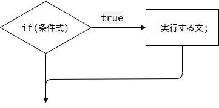
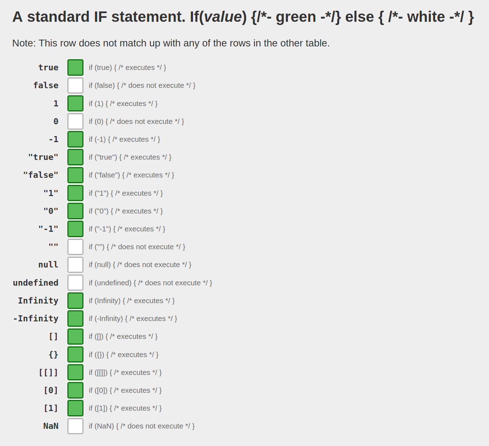

# 条件分岐

[JavaScript Primer > 基本文法 > 条件分岐](https://jsprimer.net/basic/condition/)

この章ではif文やswitch文を使った条件分岐について学んでいきます。
条件分岐を使うことで、特定の条件を満たすかどうかで行う処理を変更できます。

> ― この文章は © 2023 jsprimer project クリエイティブ・コモンズ [CC BY 4.0](https://github.com/asciidwango/js-primer/blob/master/LICENSE-CC-BY) ライセンスのもとに利用を許諾されています。

続きは [JavaScript Primer > 基本文法 > 条件分岐](https://jsprimer.net/basic/condition/) を参照しましょう。

## ポイント

- if文

## やってみよう！

<!-- prettier-ignore -->

<pre data-lang="js">
let color = "white";

if (Math.random() < 0.5) {
  color = "green";
}

document.body.style.backgroundColor = color;
document.body.textContent = `今日のラッキーカラー: ${color}`;
</pre>

- [Math - JavaScript | MDN](https://developer.mozilla.org/ja/docs/Web/JavaScript/Reference/Global_Objects/Math)
  - `Math.random()`は`0`以上`1`未満の疑似乱数を返します。
