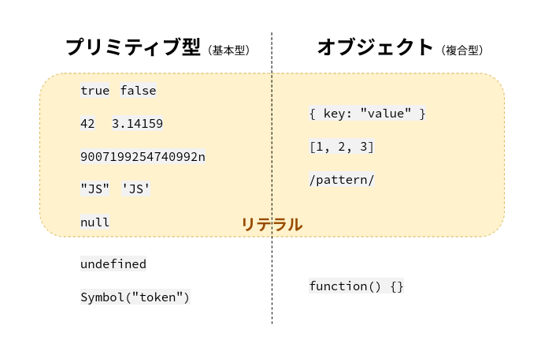

# データ型とリテラル

[JavaScript Primer > 基本文法 > データ型とリテラル](https://jsprimer.net/basic/data-type/)

JavaScriptは動的型付け言語に分類される言語であるため、静的型付け言語のような**変数の型**はありません。
しかし、文字列、数値、真偽値といった**値の型**は存在します。
これらの値の型のことを**データ型**と呼びます。

データ型を大きく分けると、**プリミティブ型**と**オブジェクト**の2つに分類されます。

プリミティブ型（基本型）は、真偽値や数値などの基本的な値の型のことです。
プリミティブ型の値は、一度作成したらその値自体を変更できないというイミュータブル（immutable）の特性を持ちます。
JavaScriptでは、文字列も一度作成したら変更できないイミュータブルの特性を持ち、プリミティブ型の一種として扱われます。

一方、プリミティブ型ではないものをオブジェクト（複合型）と呼び、
オブジェクトは複数のプリミティブ型の値またはオブジェクトからなる集合です。
オブジェクトは、一度作成した後もその値自体を変更できるためミュータブル（mutable）の特性を持ちます。
オブジェクトは、値そのものではなく値への参照を経由して操作されるため、参照型のデータとも言います。

データ型を細かく見ていくと、7つのプリミティブ型とオブジェクトからなります。

- プリミティブ型（基本型）
  - 真偽値（Boolean）: `true`または`false`のデータ型
  - 数値（Number）: `42` や `3.14159` などの数値のデータ型
  - 巨大な整数（BigInt）: ES2020から追加された`9007199254740992n`などの任意精度の整数のデータ型
  - 文字列（String）: `"JavaScript"` などの文字列のデータ型
  - undefined: 値が未定義であることを意味するデータ型
  - null: 値が存在しないことを意味するデータ型
  - シンボル（Symbol）: ES2015から追加された一意で不変な値のデータ型
- オブジェクト（複合型）
  - プリミティブ型以外のデータ
  - オブジェクト、配列、関数、クラス、正規表現、Dateなど

プリミティブ型でないものは、オブジェクトであると覚えていれば問題ありません。

`typeof`演算子を使うことで、次のようにデータ型を調べることができます。

```js
console.log(typeof true); // => "boolean"
console.log(typeof 42); // => "number"
console.log(typeof 9007199254740992n); // => "bigint"
console.log(typeof "JavaScript"); // => "string"
console.log(typeof Symbol("シンボル")); // => "symbol"
console.log(typeof undefined); // => "undefined"
console.log(typeof null); // => "object"
console.log(typeof ["配列"]); // => "object"
console.log(typeof { key: "value" }); // => "object"
console.log(typeof function () {}); // => "function"
```

プリミティブ型の値は、それぞれ`typeof`演算子の評価結果として、その値のデータ型を返します。
一方で、オブジェクトに分類される値は`"object"`となります。

配列(`[]`)とオブジェクト(`{}`)は、どちらも`"object"`という判定結果になります。
そのため、`typeof`演算子ではオブジェクトの詳細な種類を正しく判定することはできません。
ただし、関数はオブジェクトの中でも特別扱いされているため、`typeof`演算子の評価結果は`"function"`となります。
また、`typeof null`が`"object"`となるのは、歴史的経緯のある仕様のバグ[^1]です。

このことからもわかるように`typeof`演算子は、プリミティブ型またはオブジェクトかを判別するものです。
`typeof`演算子では、オブジェクトの詳細な種類を判定できないことは、覚えておくとよいでしょう。
各オブジェクトの判定方法については、それぞれのオブジェクトの章で見ていきます。

> ― この文章は © 2023 jsprimer project クリエイティブ・コモンズ [CC BY 4.0](https://github.com/asciidwango/js-primer/blob/master/LICENSE-CC-BY) ライセンスのもとに利用を許諾されています。

続きは [JavaScript Primer > 基本文法 > データ型とリテラル](https://jsprimer.net/basic/data-type/) を参照しましょう。

## ポイント

- プリミティブ型とオブジェクトがある
- リテラルはデータ型の値を直接記述できる構文として定義されたもの
- プリミティブ型リテラル
  - 真偽値 … `true` `false`
  - 数値 … `42` `3.14159` など
  - 文字列 … `"JavaScript"` など
  - BigInt … `9007199254740992n` など
  - null … `null`


