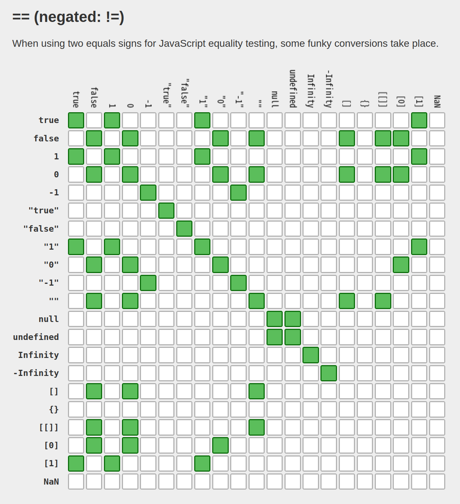

# 暗黙的な型変換

[JavaScript Primer > 基本文法 > 暗黙的な型変換](https://jsprimer.net/basic/implicit-coercion/)

この章では、明示的な型変換と暗黙的な型変換について学んでいきます。

「[演算子](operator.md)」の章にて、 等価演算子（`==`）ではなく厳密等価演算子（`===`）の利用を推奨していました。
これは厳密等価演算子（`===`）が**暗黙的な型変換**をせずに、値同士を比較できるためです。

厳密等価演算子（`===`）では異なるデータ型を比較した場合に、その比較結果は必ず`false`となります。
次のコードは、数値の`1`と文字列の`"1"`という異なるデータ型を比較しているので、結果は`false`となります。

```js runnable
// `===`では、異なるデータ型の比較結果はfalse
console.log(1 === "1"); // => false
```

しかし、等価演算子（`==`）では異なるデータ型を比較した場合に、同じ型となるように**暗黙的な型変換**をしてから比較します。
次のコードでは、数値の`1`と文字列の`"1"`の比較結果が`true`となっています。
これは、等価演算子（`==`）は右辺の文字列`"1"`を数値の`1`へと暗黙的な型変換をしてから、比較するためです。

```js runnable
// `==`では、異なるデータ型は暗黙的な型変換をしてから比較される
// 暗黙的な型変換によって 1 == 1 のように変換されてから比較される
console.log(1 == "1"); // => true
```

このように、暗黙的な型変換によって意図しない結果となるため、比較には厳密等価演算子（`===`）を使うべきです。

別の暗黙的な型変換の例として、数値と真偽値の加算を見てみましょう。
多くの言語では、数値と真偽値の加算のような異なるデータ型同士の加算はエラーとなります。
しかし、JavaScriptでは暗黙的な型変換が行われてから加算されるため、エラーなく処理されます。

次のコードでは、真偽値の`true`が数値の`1`へと暗黙的に変換されてから加算処理が行われます。

```js
// 暗黙的な型変換が行われ、数値の加算として計算される
1 + true; // => 2
// 次のように暗黙的に変換されてから計算される
1 + 1; // => 2
```

JavaScriptでは、エラーが発生するのではなく、暗黙的な型変換が行われてしまうケースが多くあります。
暗黙的に変換が行われた場合、プログラムは例外を投げずに処理が進むため、バグの発見が難しくなります。
このように、暗黙的な型変換はできる限り避けるべき挙動です。

この章では、次のことについて学んでいきます。

- 暗黙的な型変換とはどのようなものなのか
- 暗黙的ではない明示的な型変換の方法
- 明示的な変換だけでは解決しないこと

> ― この文章は © 2023 jsprimer project クリエイティブ・コモンズ [CC BY 4.0](https://github.com/asciidwango/js-primer/blob/master/LICENSE-CC-BY) ライセンスのもとに利用を許諾されています。

続きは [JavaScript Primer > 基本文法 > 暗黙的な型変換](https://jsprimer.net/basic/implicit-coercion/) を参照しましょう。

## ポイント

- 暗黙的な型変換がある
- できるだけ `===` での比較や明示的な型変換をしたほうが読みやすい

[](https://dorey.github.io/JavaScript-Equality-Table/)
