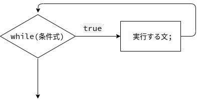

# ループと反復処理

[JavaScript Primer > 基本文法 > ループと反復処理](https://jsprimer.net/basic/loop/)

この章では、while文やfor文などの基本的な反復処理と制御文について学んでいきます。

プログラミングにおいて、同じ処理を繰り返すために同じコードを繰り返し書く必要はありません。
ループやイテレータなどを使い、反復処理として同じ処理を繰り返し実行できます。

また、for文などのような構文だけではなく、配列のメソッドを利用して反復処理を行う方法もあります。
配列のメソッドを使った反復処理もよく利用されるため、合わせて見ていきます。

> ― この文章は © 2023 jsprimer project クリエイティブ・コモンズ [CC BY 4.0](https://github.com/asciidwango/js-primer/blob/master/LICENSE-CC-BY) ライセンスのもとに利用を許諾されています。

続きは [JavaScript Primer > 基本文法 > ループと反復処理](https://jsprimer.net/basic/loop/) を参照しましょう。

## ポイント

- while文
- for文とfor...of文

## やってみよう！

<!-- prettier-ignore -->

<pre data-lang="js">
const text = "いろはにほへと";

for (const c of text) {
  document.body.textContent += `【${c}】`;
}
</pre>

