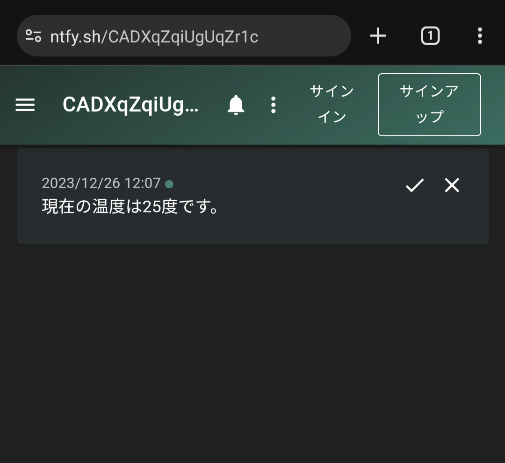

# Raspberry Piからスマートフォンにデータを送信する

[ntfy.sh](https://ntfy.sh/)を利用してRaspberry Piからスマートフォンにデータを送信する方法を説明します。

ntfy.shは、ユーザーに通知を送信するためのシンプルなサービスです。このサービスは特定のイベントや条件が発生したときに通知を送るために利用できます。

## 制約事項

**(無料枠) 1日あたりのメッセージの上限は250件です。**
10分あたり1件程度を目安にしておきましょう。

その他にもAPIにはいくつかの制限があります。注意して利用しましょう。

| 制限                     | 説明                                                                                                                                                                                                                  |
| ------------------------ | --------------------------------------------------------------------------------------------------------------------------------------------------------------------------------------------------------------------- |
| メッセージの長さ         | 各メッセージの長さは最大 4,096 バイトです。長いメッセージは添付ファイルとして扱われます。                                                                                                                             |
| リクエスト               | デフォルトでは、サーバーは訪問者あたり一度に 60 件のリクエストを許可し、その後 5 秒に 1 件の割合で許可されたリクエスト バケットを補充するように設定されています。                                                     |
| 1 日あたりのメッセージ   | デフォルトでは、メッセージ数はリクエスト制限によって制御されます。これはオーバーライドできます。 ntfy.sh では、1 日あたりのメッセージ制限は 250 です。                                                                |
| メール                   | デフォルトでは、サーバーは訪問者ごとに一度に 16 通の電子メールを送信できるように設定されており、許可された電子メール バケットは 1 時間に 1 通の割合で補充されます。 ntfy.sh では、1 日あたりの制限は 5 です。         |
| 電話通話                 | デフォルトでは、通話制限のある層を持つユーザーを除き、サーバーは電話通話を許可しません。                                                                                                                              |
| サブスクリプション制限   | デフォルトでは、サーバーは各訪問者がサーバーへの 30 接続を開いたままにすることを許可します。                                                                                                                          |
| 添付ファイルのサイズ制限 | デフォルトでは、サーバーは添付ファイルのサイズが最大 15 MB、訪問者あたり合計で最大 100 MB、訪問者全体で最大 5 GB まで許可します。 ntfy.sh では、添付ファイルのサイズ制限は 2 MB で、訪問者あたりの合計は 20 MB です。 |
| 添付ファイルの有効期限   | デフォルトでは、サーバーは 3 時間後に添付ファイルを削除するため、訪問者の添付ファイルの合計制限からスペースが解放されます。                                                                                           |
| 添付ファイルの帯域幅     | デフォルトでは、サーバーは 24 時間以内に訪問者ごとに 500 MB の添付ファイルの GET/PUT/POST トラフィックを許可します。それを超えるトラフィックは拒否されます。 ntfy.sh では、1 日の帯域幅制限は 200 MB です。           |
| トピックの総数           | デフォルトでは、サーバーは 15,000 のトピックを許可するように構成されています。ただし、ntfy.sh サーバーにはより高い制限があります。                                                                                    |

<https://docs.ntfy.sh/publish/#limitations> より
