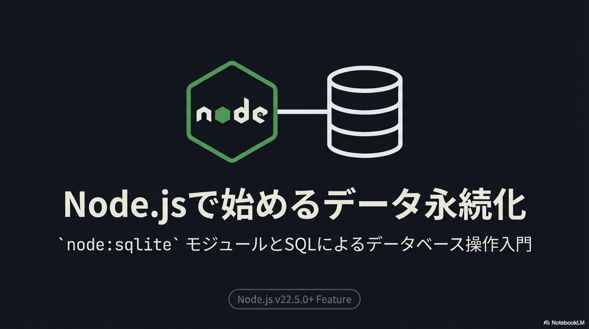
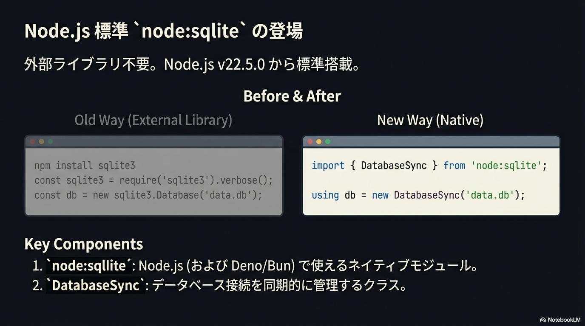
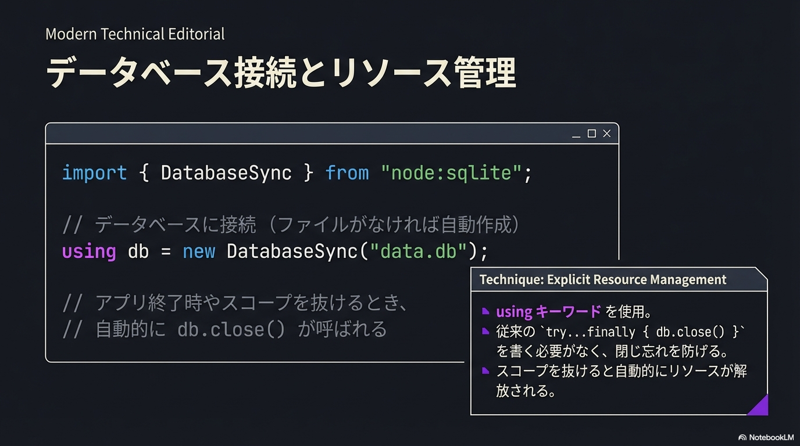
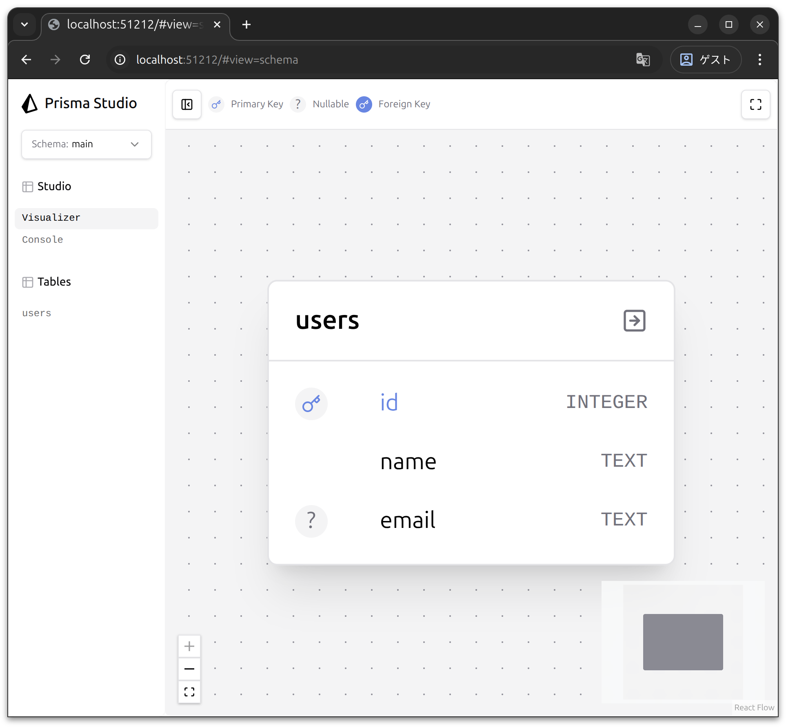
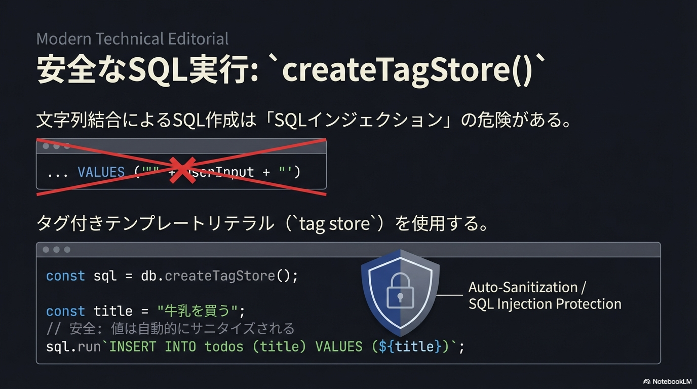
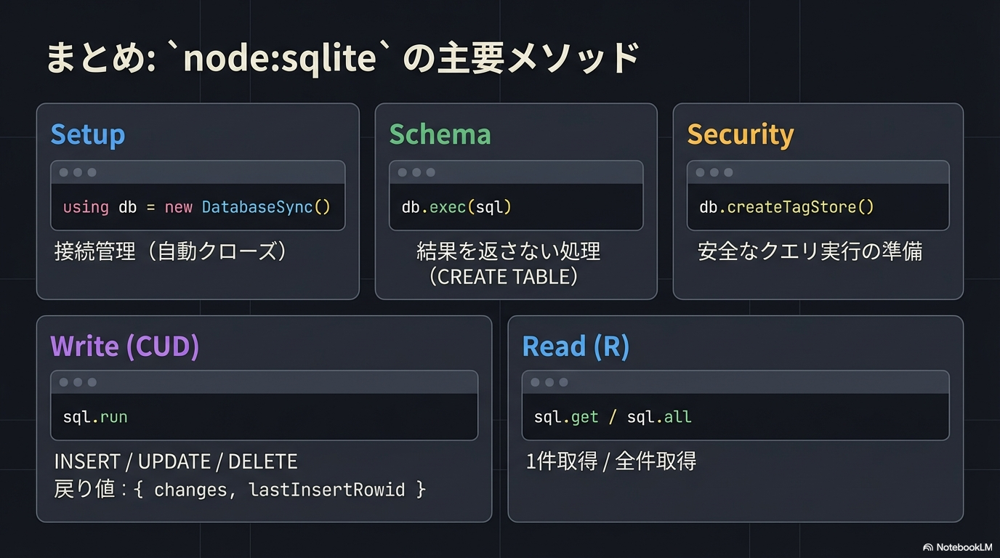

# Node.jsでSQLiteを使う



Node.js v22.5.0から、SQLiteを扱うための新しいAPIが追加されました。外部ライブラリをインストールせずに、Node.jsだけでSQLiteデータベースを操作できます。

## 2つの新機能

Node.jsには、SQLite関連の機能が2つ追加されています。

### 1. `node:sqlite` モジュール

Node.js v22.5.0で追加された、SQLiteデータベースを操作するためのモジュールです。



```js
import { DatabaseSync } from "node:sqlite";

using db = new DatabaseSync("data.db");

db.exec(`
  CREATE TABLE IF NOT EXISTS users (
    id   INTEGER PRIMARY KEY,
    name TEXT
  );
`);
```

> **Note**\
> `using` とは?
>
> このコードには `using` というキーワードがあります。これは Node.js v24 以降で利用可能な **Explicit Resource Management** という新しい構文で、変数がスコープを抜けるときに自動的にリソースを解放してくれます。ここではSQLクエリ実行後、終了前に自動的に `db.close()` が呼ばれます。
> ただし、このハンズオンではより広い環境で使えるように `using` を使わないコードで説明します。

### 2. `--experimental-webstorage` フラグ

実験的な機能として、**localStorage API** をNode.jsで使えるようにするフラグです。ブラウザの `localStorage` と同じAPIで、データを永続化できます (Node.js v24.9.0以降で利用可能)。

```bash
node --experimental-webstorage --localstorage-file=localstorage.db main.js
```

```js
// ブラウザと同じAPIが使える!
localStorage.setItem("username", "田中太郎");
console.log(localStorage.getItem("username")); // "田中太郎"
```

このハンズオンでは、より柔軟で実践的な **`node:sqlite` モジュール** を使ってSQLiteを学びます。

## `node:sqlite` モジュールを試してみよう

早速、`node:sqlite` を使ってみましょう。

### 準備

新しいディレクトリを作成して、プロジェクトを初期化します。

```bash
mkdir node-sqlite
cd node-sqlite
pnpm init --init-type=module
```

### 最初のコード

`main.js` を作成して、以下のコードを書いてみましょう。

```js
#!/usr/bin/env node
import { DatabaseSync } from "node:sqlite";

// データベースに接続 (ファイルがなければ自動で作成される)
const db = new DatabaseSync("data.db");

console.log("データベースに接続しました！");
```



実行してみましょう。

```bash
node main.js

# あるいは、実行権限を付与して実行
chmod +x main.js
# 実行
./main.js
```

```
データベースに接続しました！
```

カレントディレクトリに `data.db` というファイルが作成されているはずです。これがSQLiteのデータベースファイルです。

```bash
ls -la
```

```
-rw-r--r--  1 user  staff  8192  1月 20 10:00 data.db
```

## DatabaseSyncクラスの基本

`node:sqlite` の中心となるのが `DatabaseSync` クラスです。基本的な使い方を見ていきましょう。

### データベースへの接続

```js
import { DatabaseSync } from "node:sqlite";

// ファイルベースのデータベース
const db = new DatabaseSync("data.db");

// メモリ上のデータベース (一時的なデータベース)
const memoryDb = new DatabaseSync(":memory:");
```

### `db.exec()` - 基本的なSQLを実行する

テーブルの作成など、結果を返さないSQLを実行するときに使います。


`users` テーブルのイメージ:

| id (PK) | name | email |
| ------- | ---- | ----- |
| -       | -    | -     |

```js
db.exec(`
  CREATE TABLE IF NOT EXISTS users (
    id    INTEGER PRIMARY KEY,
    name  TEXT NOT NULL,
    email TEXT
  );
`);
```

> **Note**\
> Prisma Studioで実際にデータベースを確認する方法
>
> 実際に手元のSQLiteのファイル `data.db` にテーブルが作成されているか確認してみましょう。
> [Prisma Studio](https://www.prisma.io/studio) を使うとデータベースをGUIで確認・操作できるので非常に便利ですよ。
>
> 1. ターミナルで `npx prisma studio --url=file:data.db` を実行
> 2. 表示されるURL <http://localhost:51212> にブラウザでアクセス
> 3. `users` テーブルが作成されていることを確認
>
> 

### `db.createTagStore()` - タグ付きテンプレートでSQLを実行する

`db.createTagStore()` を使うと、**タグ付きテンプレート**でSQLを実行できます。より読みやすく、安全なコードになります。



```js
// タグストアを作成
const sql = db.createTagStore();

// データを挿入
sql.run`INSERT INTO users (name, email) VALUES (${"田中太郎"}, ${"tanaka@example.com"})`;

// 1件取得
const user = sql.get`SELECT * FROM users WHERE id = ${1}`;
console.log(user); // { id: 1, name: '田中太郎', email: 'tanaka@example.com' }

// 全件取得
const users = sql.all`SELECT * FROM users`;
console.log(users); // [{ id: 1, ... }, { id: 2, ... }]
```

`${}` の中に値を埋め込むと、自動的に **SQLインジェクション対策**がされます。安全で読みやすい書き方ですね

## 実践: ユーザーの登録と取得

学んだことを使って、ユーザーを登録・取得するプログラムを書いてみましょう。

`main.js` を以下のように書き換えます。

```js
import { DatabaseSync } from "node:sqlite";

const db = new DatabaseSync("data.db");
const sql = db.createTagStore();

// テーブルを作成 (すでにテーブルが存在する場合は何もしない)
db.exec(`
  CREATE TABLE IF NOT EXISTS users (
    id         INTEGER PRIMARY KEY,
    name       TEXT NOT NULL,
    email      TEXT,
    created_at TEXT DEFAULT CURRENT_TIMESTAMP
  );
`);

console.log("テーブルを作成しました");

// ユーザーを追加
const result1 = sql.run`INSERT INTO users (name, email) VALUES (${"田中太郎"}, ${"tanaka@example.com"})`;
console.log("追加しました:", result1);

const result2 = sql.run`INSERT INTO users (name, email) VALUES (${"山田花子"}, ${"yamada@example.com"})`;
console.log("追加しました:", result2);

// 全ユーザーを取得
const users = sql.all`SELECT * FROM users`;

console.log("\n登録されているユーザー:");
for (const user of users) {
  console.log(`  ${user.id}: ${user.name} (${user.email})`);
}
```

実行してみましょう。

```bash
node main.js
```

```
テーブルを作成しました
追加しました: { changes: 1, lastInsertRowid: 1 }
追加しました: { changes: 1, lastInsertRowid: 2 }

登録されているユーザー:
  1: 田中太郎 (tanaka@example.com)
  2: 山田花子 (yamada@example.com)
```

`users` テーブルのイメージ:

| id (PK) | name       | email                |
| ------- | ---------- | -------------------- |
| 1       | `田中太郎` | `tanaka@example.com` |
| 2       | `山田花子` | `yamada@example.com` |

もう一度実行すると、さらにユーザーが追加されます (IDは3, 4になります)。これがデータの永続化です。

### `sql.run` の戻り値

`sql.run` は、実行結果の情報を返します。

```js
const result = sql.run`INSERT INTO users (name, email) VALUES (${"佐藤次郎"}, ${"sato@example.com"})`;
console.log(result);
// {
//   changes: 1,           // 影響を受けた行数
//   lastInsertRowid: 3    // 最後に挿入された行のID
// }
```

- **changes**: INSERT、UPDATE、DELETEで影響を受けた行数
- **lastInsertRowid**: INSERTで自動生成されたID

### エラーハンドリング

SQLにエラーがあると例外がスローされます。

```js
try {
  db.exec("CREATE TABLE invalid syntax;");
} catch (error) {
  console.error("SQLエラー:", error.message);
}
```

## やってみよう

1. `main.js` を実行して、ユーザーが追加されることを確認しましょう
2. 何度か実行して、データが蓄積されることを確認しましょう
3. `data.db` を削除してから実行すると、どうなるか試してみましょう

## ポイント



- **`node:sqlite`**: Node.js (Deno/Bunでも使える) SQLite モジュール
- **`DatabaseSync`**: データベース接続を管理するクラス
- **`db.exec(sql)`**: 結果を返さないSQLを実行 (CREATE TABLEなど)
- **`db.createTagStore()`**: タグ付きテンプレートでSQLを実行できるストアを作成
  - **`sql.run`**: INSERT/UPDATE/DELETEを実行。自動的にSQLインジェクション対策される
  - **`sql.get`**: 1件取得
  - **`sql.all`**: 全件取得

## 参考文献

- [Node.js SQLite documentation](https://nodejs.org/api/sqlite.html)
