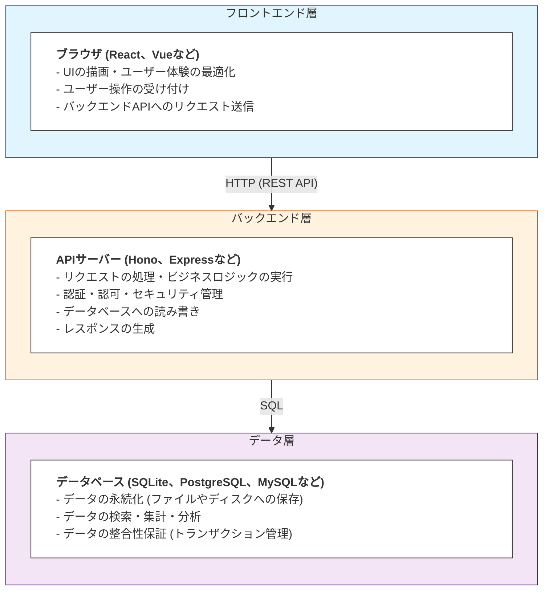

# 概要

<iframe
  src="https://drive.google.com/file/d/1Yiy5qdBgug87RC-tcFI-V84xAg9Q8zqi/preview"
  style="border: none; width: 100%; max-width: 960px; aspect-ratio: 16 / 9;"
  allowfullscreen="true">
</iframe>

[💡 NotebookLM で解説を聞く](https://notebooklm.google.com/notebook/365f3a94-657c-45ec-97cf-b523e506db71)

Webアプリケーションでデータを保存するとき、どんな仕組みが使われているのでしょうか？\
以前学んだ「[モダンWebアーキテクチャ](../environment/architecture.md)」の知識を踏まえて、実際にデータを扱う方法を見ていきましょう。

## 3層アーキテクチャ

データがどう流れるのか見ていきましょう。典型的には大きく3つの層に分かれています。



## フロントエンドとバックエンド

「[モダンWebアーキテクチャ](../environment/architecture.md)」で見た通り、現代のWebアプリケーション開発では、フロントエンドエンジニアとバックエンドエンジニアで役割が分かれることが多いです。データベースはバックエンドの重要な担当領域ですが、フロントエンドエンジニアも理解しておくと協業がスムーズになります。

### フロントエンドエンジニアの責務

ユーザーが直接触れる部分を担当します。

| 技術領域       | 主な課題                                          |
| -------------- | ------------------------------------------------- |
| UI/UX          | 画面のデザイン実装、ユーザー操作のハンドリング    |
| 状態管理       | フォームの入力値、表示データの管理                |
| API連携        | fetch/axiosでのリクエスト送信、レスポンス処理     |
| バリデーション | 入力値の形式チェック (最終チェックはバックエンド) |

```js
// フロントエンドでのAPI連携の例 (React)
import useSWR from "swr";

function TodoList() {
  // SWRでバックエンドAPIからデータを取得
  const { data: todos, error, mutate } = useSWR("/api/todos");

  if (error) return <div>エラーが発生しました</div>;
  if (!todos) return <div>読み込み中...</div>;

  return (
    <ul>
      {todos.map((todo) => (
        <li key={todo.id}>{todo.title}</li>
      ))}
    </ul>
  );
}
```

### バックエンドエンジニアの責務

ドメインロジックとデータ処理を担当します (このハンズオンで学ぶ領域です)。

| 技術領域         | 主な課題                                          |
| ---------------- | ------------------------------------------------- |
| API設計・実装    | エンドポイントの設計、リクエスト/レスポンスの処理 |
| ドメインロジック | アプリケーション固有のルールや制約の実装          |
| データベース     | テーブル設計、SQL作成、データの読み書き           |
| バリデーション   | 入力値の検証、エラーハンドリング                  |
| セキュリティ     | 認証・認可、SQLインジェクション対策               |

```js
// バックエンドでのAPI実装の例 (Hono)
import { Hono } from "hono";
import { DatabaseSync } from "node:sqlite";

const app = new Hono();
using db = new DatabaseSync("data.db");
const sql = db.createTagStore();

// ToDoリスト取得API
app.get("/api/todos", (c) => {
  // データベースから全件取得
  const todos = sql.all`SELECT * FROM todos`;
  return c.json(todos);
});

// ToDo作成API
app.post("/api/todos", async (c) => {
  const { title } = await c.req.json();

  // データベースに保存
  const result = sql.run`INSERT INTO todos (title, completed) VALUES (${title}, ${false})`;

  return c.json({ id: result.lastInsertRowid, title, completed: false }, 201);
});
```

### 境界線は曖昧になりつつある

以前触れたように、最近はこの境界線が曖昧になってきています。

- **フルスタックフレームワーク** (Next.jsやAstroなど) の登場で、フロントエンドエンジニアもサーバーサイドのコードを書く機会が増えた
- **サーバーレスアーキテクチャ**により、インフラ管理の負担が軽減された
- **小規模なチーム**では、両方を担当することも多い

このハンズオンで学ぶSQLiteとSQLの知識は、どちらの立場でも役立ちます (フロントエンド寄りでも、データの仕組みを理解しているとAPI設計の会話がスムーズになります)。

## データベースの種類とアーキテクチャ選択

アーキテクチャパターンによって、データベースの選択も変わってきます。

### リレーショナルデータベース (RDB)

データを**テーブル (表)** の形式で管理します。テーブル同士を関連付けて、複雑なデータ構造を表現できます (伝統的で信頼性の高い方式です)。

| 名前       | 特徴                                       | 適したアーキテクチャ                 |
| ---------- | ------------------------------------------ | ------------------------------------ |
| **SQLite** | ファイルベース、サーバー不要、組み込み向け | モノリシック、小規模サーバーレス     |
| PostgreSQL | 高機能、大規模向け、クラウドサービスで人気 | マイクロサービス、大規模モノリシック |

これらは全て**SQL** (Structured Query Language)という共通言語でデータを操作します (一度学べば、どのRDBでも応用できますね)。

```sql
-- SQLの例 (どのRDBでもほぼ同じ)
SELECT * FROM todos WHERE completed = false;
INSERT INTO todos (title, completed) VALUES ('買い物', false);
UPDATE todos SET completed = true WHERE id = 1;
```

### NoSQLデータベース

テーブル形式以外の方法でデータを管理します。柔軟性が高く、大規模分散システムに適しています。

| 名前     | データ形式     | 特徴                    |
| -------- | -------------- | ----------------------- |
| Redis    | キー・バリュー | 超高速、キャッシュ向け  |
| DynamoDB | キー・バリュー | AWSのマネージドサービス |

### このハンズオンでSQLiteを使う理由

アーキテクチャ選択は組織やプロジェクトの状況に合わせるべきです。このハンズオンでは、学習に最適なSQLiteを選びました。

1. **サーバー不要**: ファイル1つで動作するので、セットアップが簡単 (インフラ管理の学習負荷を減らせます)
2. **Node.js組み込み**: Node.js v22.5.0から標準で使える (追加のインストール不要)
3. **SQLの学習に最適**: 本格的なRDBと同じSQLが使える (PostgreSQLやMySQLへの移行も容易)
4. **実用的**: 小〜中規模アプリなら本番でも十分使える (モノリシックアーキテクチャに最適)

```js
// Node.js標準のSQLite (追加パッケージ不要)
import { DatabaseSync } from "node:sqlite";

using db = new DatabaseSync("data.db");

db.exec(`
  CREATE TABLE IF NOT EXISTS todos (
    id INTEGER PRIMARY KEY,
    title TEXT
  )
`);
```

## データの流れを追ってみよう

ToDoアプリで「新しいタスクを追加する」操作を例に、3層アーキテクチャでのデータの流れを見てみましょう。

```
1. ユーザーがフォームに入力して送信ボタンをクリック
   ↓
2. フロントエンド (React)がPOSTリクエストを送信
   fetch('/api/todos', {
     method: 'POST',
     body: JSON.stringify({ title: '買い物' })
   })
   ↓
3. バックエンド (Hono)がリクエストを受け取り、データを検証
   app.post('/api/todos', async (c) => {
     const { title } = await c.req.json();
     // バリデーション: titleが空でないかチェック
     if (!title) return c.json({ error: 'Title is required' }, 400);
     ...
   })
   ↓
4. SQLを実行してデータベースに保存
   INSERT INTO todos (title, completed) VALUES ('買い物', false)
   ↓
5. データベースが保存を確認し、新しいIDを返す
   → { lastID: 1, changes: 1 }
   ↓
6. バックエンドがレスポンスを生成して返す
   return c.json({ id: 1, title: '買い物', completed: false }, 201)
   ↓
7. フロントエンドがレスポンスを受け取り、UIを更新
   setTodos([...todos, newTodo])
```

このハンズオンでは、**3〜6の部分** (バックエンド層とデータ層)を実装していきます。

## アーキテクチャと実装の関係

それぞれのアーキテクチャパターンが、実際の実装にどう影響するか見てみましょう。

### モノリシック + SQLite (このハンズオンの構成)

```
[Todoアプリ]
  ├─ /app (フロントエンド)
  └─ /api (バックエンドAPI)
      └─ data.db (SQLiteファイル)
```

✅ 適している状況:

- 小規模チーム (1-5人)
- 学習・プロトタイプ開発
- 中規模アプリ

### 大規模・分散システム向けの構成

アプリケーションが成長すると、より強力なデータベースや分散アーキテクチャが必要になります。

#### 例: マイクロサービス + PostgreSQL/MySQL

```
[ユーザーサービス]     [ToDoサービス]      [通知サービス]
       ↓                    ↓                    ↓
[PostgreSQL]         [PostgreSQL]          [PostgreSQL]
```

#### 例: エッジランタイム + 分散データベース

エッジランタイム（以前学んだCloudflare WorkersやVercel Edge Functionsなど）では、従来とは異なるデータベース選択が必要です。

```
[Cloudflare Workers]  → [Durable Objects (SQLite API)]
                      → [Hyperdrive (PostgreSQL接続)]

[Vercel Edge Functions] → [Vercel Postgres]
                        → [Upstash Redis]
```

✅ 適している状況:

- 大規模チーム（複数の独立したチーム）
- 高いスケーラビリティと可用性が必要
- 世界中のユーザーを対象とするアプリケーション

**代表的な技術**

Honoの章で学んだように、エッジランタイムには実行時間やメモリの制約があります。そのため、データベースも特別な選択肢が用意されています。

- **[Hyperdrive](https://developers.cloudflare.com/hyperdrive/)**: 既存のPostgreSQLやMySQLをエッジから高速アクセスできる接続プール技術
- **[Durable Objects](https://developers.cloudflare.com/durable-objects/api/sqlite-storage-api/)** (SQLite API): 世界中のエッジサーバーに分散されたSQLite互換のストレージ。各地域でデータを保持しながら低遅延アクセスを実現

```ts
// Hyperdriveを使う例
import postgres from "postgres";

const sql = postgres(env.HYPERDRIVE.connectionString);

export const todo = {
  async all() {
    return await sql`SELECT * FROM todos`;
  },
};

// Durable Objectsを使う例
export class TodoStorage extends DurableObject {
  sql: SqlStorage;
  constructor(ctx: DurableObjectState, env: Env) {
    super(ctx, env);
    this.sql = ctx.storage.sql;
  }
  async all() {
    return Array.from(this.sql.exec("SELECT * FROM todos;"));
  }
}
```

> **Note**
> エッジランタイムでのデータベースは急速に進化しています。以前学んだ「[結果整合性](../hono/overview.md#データの一貫性の課題)」の概念を理解した上で、適切な技術を選択することが重要です。

**組織構造とアーキテクチャを一致させる**ことが重要です。このハンズオンでは、学習に最適なモノリシック + SQLiteの構成で進めます。分散システムでのデータベース活用は、基礎を学んだ後の応用編として挑戦してみてください。

## ポイント

- **3層アーキテクチャ**: フロントエンド層・バックエンド層・データ層の3つで構成
- **SQL**: RDBを操作する共通言語。SQLite、PostgreSQL、MySQLなど様々なDBで共通
- **SQLite**: ファイル1つで動作するRDB。Node.js標準で使え、学習・小規模アプリに最適

次のセクションでは、実際にSQLiteを使ってデータベースを操作していきます。
