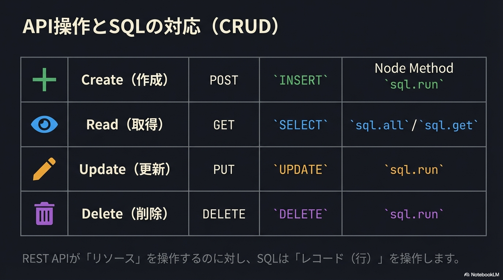
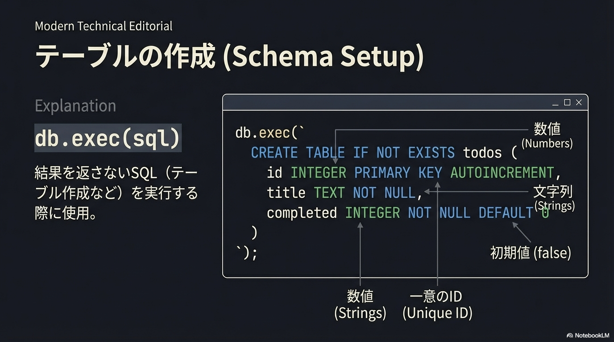
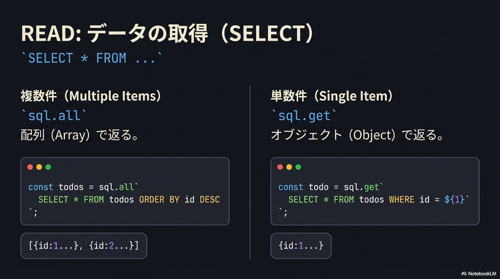
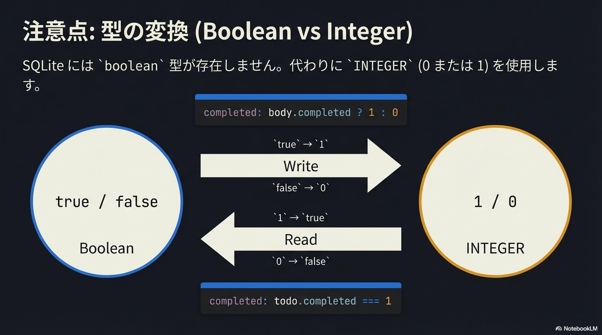
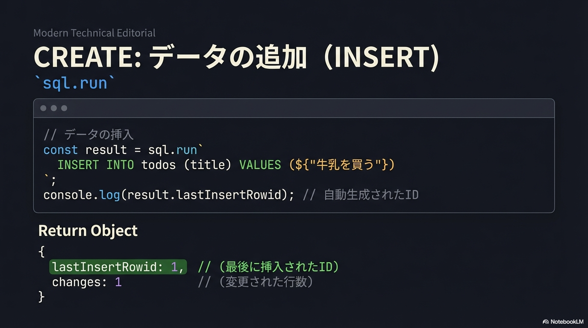
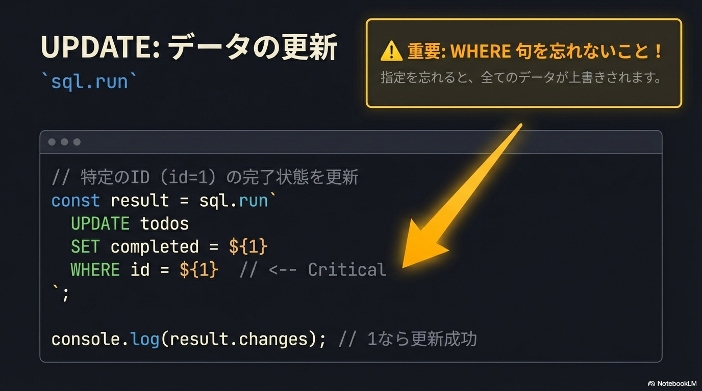
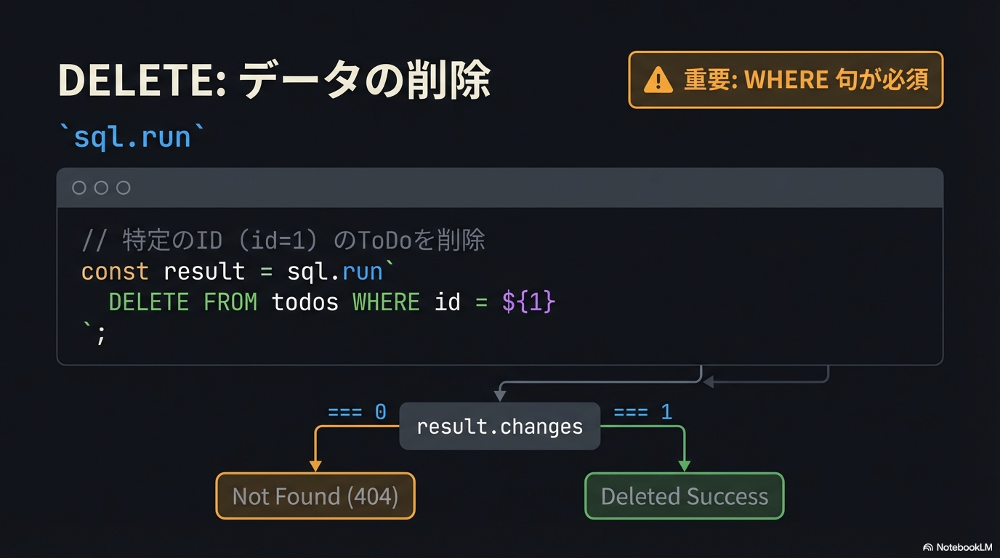

# ToDoアプリで学ぶSQL入門

このチュートリアルでは、**SQL (Structured Query Language)** の基本を学びながら、Node.js標準の `node:sqlite` を使って、データをデータベースに保存する「永続化」アプリへと作り変えていきます。

## SQLの4大操作: CRUD

SQLite を使う準備ができたので、SQLの基本を学んでいきましょう。SQL (Structured Query Language)は、データベースを操作するための言語です。
データベース操作は、基本的に4つの操作に分類できます。これを **CRUD** (クラッド)と呼びます。

### CRUD操作とSQLの対応

| 操作       | SQL文  | 意味             | 例                   |
| ---------- | ------ | ---------------- | -------------------- |
| **C**reate | INSERT | データを作成する | 新しいToDoの追加     |
| **R**ead   | SELECT | データを読み取る | ToDo一覧の表示       |
| **U**pdate | UPDATE | データを更新する | ToDoの完了状態を変更 |
| **D**elete | DELETE | データを削除する | 不要なToDoの削除     |



具体例:

```js
// 新しい ToDo を作成
sql.run`INSERT INTO todos (title) VALUES (${"牛乳を買う"})`;
// 全ての ToDo を取得
sql.all`SELECT * FROM todos`;
// ID 1 の ToDo を取得
sql.get`SELECT * FROM todos WHERE id = ${1}`;
// ID 1 のToDoを完了に更新
sql.run`UPDATE todos SET completed = ${1} WHERE id = ${1}`;
// ID 1 の ToDo を削除
sql.run`DELETE FROM todos WHERE id = ${1}`;
```

見覚えのあるおなじみパターンですよね。「[REST API](../api/rest-basics.md)」と全く同じ概念です。REST APIが「リソース」を操作するのに対し、SQLは「データ (レコード)」を操作します。

## 準備: テンプレートのセットアップ

まずは、ベースとなるToDoアプリのテンプレートを用意します。ターミナルで以下のコマンドを実行してください。

```bash
git clone https://github.com/kou029w/todo-template.git
cd todo-template
pnpm i
pnpm dev
```

ブラウザで <http://localhost:5173> にアクセスするとアプリが動きますが、サーバーを停止（`Ctrl+C`）して再起動するとデータは消えてしまいます。これを直していきましょう。

今回編集するのは、バックエンド側の `api/src/index.ts` です。

## データベースの作成

まずはデータを保存する箱、「テーブル」を作る必要があります。Excelのシートを作るようなイメージですね。



### CREATE TABLE の構文

```sql
CREATE TABLE IF NOT EXISTS テーブル名 (
  カラム名 データ型 制約,
  ...
);
```

ここで使う `INTEGER` は整数、`TEXT` は文字列、`PRIMARY KEY` は主キー（ID）を意味します。

### やってみよう: 接続とテーブル作成

`todos` テーブルのイメージ:

| id (PK) | title | completed |
| ------- | ----- | --------- |
| -       | -     | -         |

`api/src/index.ts` の冒頭を以下のように書き換えて、データベースファイル (`data.db`) に接続し、テーブルを作りましょう。

```ts
import { serve } from "@hono/node-server";
import { Hono } from "hono";
import { cors } from "hono/cors";
// node:sqlite をインポート
import { DatabaseSync } from "node:sqlite";

const app = new Hono();

app.use("/*", cors());

// データベースに接続
const db = new DatabaseSync("data.db");
const sql = db.createTagStore();

// テーブルを作成（なければ作る）
db.exec(`
  CREATE TABLE IF NOT EXISTS todos (
    id        INTEGER PRIMARY KEY,
    title     TEXT NOT NULL,
    completed INTEGER NOT NULL DEFAULT 0
  );
`);

console.log("データベースを初期化しました");
// ※ 古い let todos = []; などの変数は削除
```

## データの取得

次に、保存されたデータを取得して表示できるようにします。



### SELECT 文

データを取得するには `SELECT` を使います。「`todos` テーブルから全てのカラム (`*`) を取得し、`id` の降順 (`DESC`) で並べる」という命令は以下のようになります。

```sql
SELECT * FROM todos ORDER BY id DESC;
```

### やってみよう: 一覧取得の実装

`GET /api/todos` エンドポイントを修正します。

```ts
// GET /api/todos - ToDoの一覧を取得
app.get("/api/todos", (c) => {
  const todos = sql.all`SELECT * FROM todos ORDER BY id DESC`;

  // SQLiteでは true/false が 1/0 で保存されるため、変換が必要です
  const result = todos.map((todo) => ({
    id: todo.id,
    title: todo.title,
    completed: todo.completed === 1,
  }));

  return c.json(result);
});
```

### 型の変換

SQLiteでは、`boolean` 型が存在しません。代わりに `INTEGER` 型の `0`（false）と `1`（true）を使用します。



データの保存時と取得時に型変換が必要です。

## データの追加

新しいToDoを追加しましょう。



### INSERT 文

`todos` テーブルのイメージ:

| id (PK) | title        | completed |
| ------- | ------------ | --------- |
| 1       | `牛乳を買う` | 0         |

データを追加するのは `INSERT` です。

```sql
INSERT INTO todos (title) VALUES ('牛乳を買う');
```

> **Note**: SQL文にユーザーからの入力を直接埋め込むのは**絶対にNG**です。「SQLインジェクション」の危険があります。必ず `${変数}` のようにプレースホルダを使って、安全に値を渡しましょう。

```js
// ❌ ダメな例 (SQLインジェクションの危険あり)
const title = "牛乳を買う";
db.exec(`INSERT INTO todos (title) VALUES ('${title}');`);

// ✅ 良い例
const sql = db.createTagStore();
sql.run`INSERT INTO todos (title) VALUES (${title})`;
```

### やってみよう: 新規作成の実装

`POST /api/todos` エンドポイントを修正します。

```ts
// POST /api/todos - 新しいToDoを作成
app.post("/api/todos", async (c) => {
  const body = await c.req.json();

  if (!body.title || body.title.trim() === "") {
    return c.json({ error: "Title is required" }, 400);
  }

  // データを追加
  const result = sql.run`INSERT INTO todos (title) VALUES (${body.title})`;

  // 作成した結果のレコードのIDを使って再取得
  const newTodo = sql.get`SELECT * FROM todos WHERE id = ${result.lastInsertRowid}`;

  return c.json(
    {
      id: newTodo.id,
      title: newTodo.title,
      completed: newTodo.completed === 1,
    },
    201,
  );
});
```

`result.lastInsertRowid` を使うと、今登録されたデータのIDが分かります。便利ですね。

## データの更新・削除

最後に、更新と削除です。

### UPDATE 文



```sql
-- 更新
UPDATE todos SET completed = 1 WHERE id = 1;
```

### DELETE 文



```sql
-- 削除
DELETE FROM todos WHERE id = 1;
```

> **Note**: `WHERE`（条件）を書き忘れると、**全てのデータが更新・削除されてしまいます**。操作対象のIDを必ず指定しましょう。

### やってみよう: 更新と削除の実装

`PUT` と `DELETE` のエンドポイントを修正します。

```ts
// PUT /api/todos/:id - ToDoを更新
app.put("/api/todos/:id", async (c) => {
  const id = Number(c.req.param("id"));
  const body = await c.req.json();

  // 存在確認
  const existingTodo = sql.get`SELECT * FROM todos WHERE id = ${id}`;
  if (!existingTodo) {
    return c.json({ error: "Todo not found" }, 404);
  }

  // 部分更新
  if (body.title !== undefined) {
    sql.run`
      UPDATE todos
        SET   title = ${body.title}
        WHERE id = ${id}
    `;
  }

  if (body.completed !== undefined) {
    // boolean を 0/1 に変換して保存
    sql.run`
      UPDATE todos
        SET   completed = ${body.completed ? 1 : 0}
        WHERE id = ${id}
    `;
  }

  const updatedTodo = sql.get`SELECT * FROM todos WHERE id = ${id}`;

  // 返却時に 0/1 を boolean に戻すのを忘れずに
  return c.json({
    id: updatedTodo.id,
    title: updatedTodo.title,
    completed: updatedTodo.completed === 1,
  });
});

// DELETE /api/todos/:id - ToDoを削除
app.delete("/api/todos/:id", (c) => {
  const id = Number(c.req.param("id"));

  const existingTodo = sql.get`SELECT * FROM todos WHERE id = ${id}`;
  if (!existingTodo) {
    return c.json({ error: "Todo not found" }, 404);
  }

  sql.run`DELETE FROM todos WHERE id = ${id}`;

  return c.json({ message: "Deleted" });
});
```

## 動作確認

サーバーを再起動して、動作を確認しましょう。

```bash
pnpm dev
```

1. ブラウザで [http://localhost:5173](http://localhost:5173) にアクセス
2. いくつかToDoを追加
3. `Ctrl+C` でサーバーを停止
4. `pnpm dev` で再起動
5. **ToDoが残っていることを確認！**

`api/` ディレクトリに `data.db` ファイルが作成されているはずです。これがSQLiteのデータベースファイルです。

## やってみよう！

1. ToDoを追加して、サーバーを再起動してもデータが残ることを確認
2. ToDoの完了/未完了を切り替えて、再起動後も状態が保持されることを確認
3. `data.db` を削除してからサーバーを起動すると、空のToDoリストになることを確認

## ポイント

- **永続化**: データをファイル（データベース）に保存することで、サーバー再起動後もデータが残る
- **CREATE TABLE**: テーブルを作成 (`db.exec()` を使用)
- **INSERT**: データ (レコード) を追加 (`sql.run` を使用)
- **SELECT**: データを取得 (`sql.get` で1件、`sql.all` で複数件、`WHERE` で条件指定、`ORDER BY` で並び替え)
- **UPDATE**: データを更新 (`sql.run` を使用、**WHERE を忘れず**)
- **DELETE**: データを削除 (`sql.run` を使用、**WHERE を忘れず**)
- **型変換**: SQLiteの `INTEGER`（0/1）とJavaScriptの `boolean` の変換が必要
- `sql.run`: INSERT/UPDATE/DELETEを実行するために使用
  - `result.lastInsertRowid`: INSERTで自動生成されたIDを取得
  - `result.changes`: UPDATE/DELETEで影響を受けた行数を取得

## 完成コード

すべての修正を反映した `api/src/index.ts` の完成版です。

```js
import { serve } from "@hono/node-server";
import { Hono } from "hono";
import { cors } from "hono/cors";
import { DatabaseSync } from "node:sqlite";

const app = new Hono();

app.use("/*", cors());

const db = new DatabaseSync("data.db");
const sql = db.createTagStore();

db.exec(`
  CREATE TABLE IF NOT EXISTS todos (
    id        INTEGER PRIMARY KEY,
    title     TEXT NOT NULL,
    completed INTEGER NOT NULL DEFAULT 0
  );
`);

console.log("データベースを初期化しました");

// GET /api/todos - ToDoの一覧を取得
app.get("/api/todos", (c) => {
  const todos = sql.all`SELECT * FROM todos ORDER BY id DESC`;

  const result = todos.map((todo) => ({
    id: todo.id,
    title: todo.title,
    completed: todo.completed === 1,
  }));

  return c.json(result);
});

// GET /api/todos/:id - 特定のToDoを取得
app.get("/api/todos/:id", (c) => {
  const id = Number(c.req.param("id"));

  const todo = sql.get`SELECT * FROM todos WHERE id = ${id}`;

  if (!todo) {
    return c.json({ error: "Todo not found" }, 404);
  }

  return c.json({
    id: todo.id,
    title: todo.title,
    completed: todo.completed === 1,
  });
});

// POST /api/todos - 新しいToDoを作成
app.post("/api/todos", async (c) => {
  const body = await c.req.json();

  if (!body.title || body.title.trim() === "") {
    return c.json({ error: "Title is required" }, 400);
  }

  const result = sql.run`INSERT INTO todos (title) VALUES (${body.title})`;

  const newTodo = sql.get`SELECT * FROM todos WHERE id = ${result.lastInsertRowid}`;

  return c.json(
    {
      id: newTodo.id,
      title: newTodo.title,
      completed: newTodo.completed === 1,
    },
    201,
  );
});

// PUT /api/todos/:id - ToDoを更新
app.put("/api/todos/:id", async (c) => {
  const id = Number(c.req.param("id"));
  const body = await c.req.json();

  const existingTodo = sql.get`SELECT * FROM todos WHERE id = ${id}`;

  if (!existingTodo) {
    return c.json({ error: "Todo not found" }, 404);
  }

  if (body.title !== undefined) {
    sql.run`UPDATE todos SET title = ${body.title} WHERE id = ${id}`;
  }

  if (body.completed !== undefined) {
    sql.run`UPDATE todos SET completed = ${
      body.completed ? 1 : 0
    } WHERE id = ${id}`;
  }

  const updatedTodo = sql.get`SELECT * FROM todos WHERE id = ${id}`;

  return c.json({
    id: updatedTodo.id,
    title: updatedTodo.title,
    completed: updatedTodo.completed === 1,
  });
});

// DELETE /api/todos/:id - ToDoを削除
app.delete("/api/todos/:id", (c) => {
  const id = Number(c.req.param("id"));

  const existingTodo = sql.get`SELECT * FROM todos WHERE id = ${id}`;

  if (!existingTodo) {
    return c.json({ error: "Todo not found" }, 404);
  }

  const result = sql.run`DELETE FROM todos WHERE id = ${id}`;

  return c.json({ message: "Deleted" });
});

const port = 3000;
console.log(`Server is running on http://localhost:${port}`);

serve({
  fetch: app.fetch,
  port,
});
```

## 早く進んだ人向け

Honoの公式ドキュメントには、ベストプラクティスがまとめられています。余裕があれば読んでみてください。

- [Hono Best Practices](https://hono.dev/docs/guides/best-practices)

特に以下のトピックが参考になります。

- ルーティングの整理方法
- ミドルウェアの活用
- エラーハンドリング

## 参考文献

- [SQLite SQL Syntax](https://www.sqlite.org/lang.html)
- [SQLチュートリアル - W3Schools](https://www.w3schools.com/sql/)
- [todo-template リポジトリ](https://github.com/kou029w/todo-template)
- [Node.js SQLite documentation](https://nodejs.org/api/sqlite.html)
