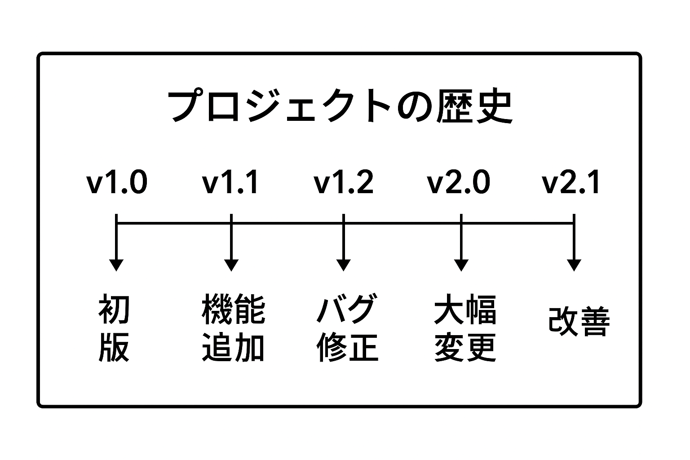

# Git・GitHub基礎

この章では、Web開発に欠かせないGitとGitHubについて一緒に学んでいきましょう。Gitは最初は少し難しく感じるかもしれませんが、慣れてしまえばとても便利なツールです。気楽に読み進めてくださいね。

## 学習目標

- Gitの基本的な仕組みとバージョン管理について理解する
- GitHubを使って自分のコードを管理できるようになる
- ブランチを使った開発の流れを覚える
- チームでの開発に必要なPull Requestの使い方を学ぶ

## Gitって何？

### バージョン管理システム（VCS）

みなさんは、大切な文書やファイルを編集するとき、「保存するまえに念のためコピーを作っておこう」と思ったことはありませんか？Gitはそのような「ファイルの履歴管理」を自動的にやってくれる便利なツールです。



### Gitの特徴

Gitには他のツールにない素晴らしい特徴があります。

- **分散型**: チーム全員が完全な履歴を持つ（一人が消しても大丈夫！）
- **高速**: ほとんどの操作がサクサク動く
- **ブランチ**: 並行開発がとても簡単
- **非線形開発**: 複数人での開発に最適化されている

### 基本的な仕組み

Gitには3つの重要な場所があります。最初は覚えにくいかもしれませんが、この図を頭に入れておくと後で理解が深まりますよ。

#### Gitの3つの領域

> 
>
> _画像: <https://git-scm.com/book/en/v2/Getting-Started-What-is-Git%3F> より引用_

1. Working Directory - 作業ディレクトリ。ファイルやフォルダーの実体があります。ここでファイルを編集します。
2. Staging Area - コミットする前に変更内容を一時的にまとめておく (ステージング) するための領域です。`git add` することで変更内容が「ステージング」として扱われます。
3. Repository - あらゆる変更履歴を保存しておく保管庫。`git commit` することで「ステージング」にある変更内容が「メッセージ」とともに「コミット」に移されます。`.git` ディレクトリ内のファイルによって管理されます。この `.git` ディレクトリを同期 (push/pull) することによって共同編集を可能にします。

## Gitをインストールしてみよう

それでは、実際にGitをインストールして使ってみましょう！お使いのOSに合わせて進めてくださいね。

### Windows (WSL) ・Linux の場合

```bash
# Ubuntu/Debian の場合
sudo apt update
sudo apt install git

# CentOS/RHEL の場合
sudo yum install git
```

### Windows (ネイティブ) の場合

```powershell
# Git for Windows のインストール
# https://gitforwindows.org/ からダウンロードして実行してください

# または Chocolatey を使う場合（上級者向け）
choco install git

# または winget を使う場合（Windows 10/11）
winget install Git.Git
```

### macOSの場合

```bash
# Homebrew でインストール（推奨）
brew install git

# Xcode Command Line Tools でも可能
xcode-select --install
```

### 最初の設定をしよう

Gitをインストールしたら、必ず最初に自分の情報を設定しましょう。これをしないとコミットができませんからね。

```bash
# あなたの名前とメールアドレスを設定します
git config --global user.name "あなたの名前"
git config --global user.email "your.email@example.com"

# デフォルトブランチ名を設定（最近は main が一般的です）
git config --global init.defaultBranch main

# エディタの設定（VS Codeを使う場合）
git config --global core.editor "code --wait"

# 設定の確認
git config --list
```

> **Note**: GitHubで使用するメールアドレスと同じものを設定することをおすすめします。

## 基本的なGitの操作を覚えよう

それでは、実際にGitを使って作業をしてみましょう。最初は一つずつゆっくりと進めていきますね。

### 1. はじめてのリポジトリを作ってみよう

```bash
# 新しいプロジェクト用のフォルダを作ります
mkdir my-project
cd my-project

# Gitリポジトリとして初期化（これでGit管理が開始されます）
git init

# 最初のファイルを作ってみましょう
echo "# My Project" > README.md
git add README.md
git commit -m "Initial commit"
```

これで最初のコミット（保存ポイント）ができました！

### 2. 日常的な作業の流れ

普段の開発では、この3つの操作を繰り返します。慣れてしまえば自然にできるようになりますよ。

```bash
# ファイルを編集した後...

git status          # 何が変更されたかチェック
git add .           # すべての変更をステージング（次のコミットに含める準備）
git commit -m "新しい機能を追加"  # コミット（保存ポイントを作成）

# 特定のファイルだけコミットしたい場合
git add src/index.js
git commit -m "index.jsを更新"
```

### 3. 履歴を確認してみよう

作業の履歴を見ることができます。これがGitの魅力の一つですね。

```bash
# コミットの履歴を見る
git log             # 詳細な履歴
git log --oneline   # 簡潔に一行で表示（見やすいです）
git log --graph     # ブランチの分岐を視覚的に表示

# 変更内容を詳しく確認
git diff            # まだコミットしていない変更内容
git diff --cached   # コミット予定の変更内容
git show HEAD       # 最新コミットの詳細
```

## ブランチを使ってみよう

ブランチは、Gitの中でも特に便利な機能です。「元のコードを壊さずに新しい機能を試せる」と考えてください。

### 1. ブランチの基本操作

```bash
# 現在のブランチを確認
git branch          # ローカルのブランチ一覧
git branch -r       # リモートのブランチ一覧
git branch -a       # すべてのブランチ

# 新しいブランチを作って移動
git branch feature/new-feature     # ブランチを作成
git checkout feature/new-feature   # ブランチに移動

# 上記を一度にやる（便利です！）
git checkout -b feature/new-feature

# さらに新しいGitでは（2.23以降）
git switch -c feature/new-feature
```

### 2. ブランチ戦略について

チームで開発するときの基本的なパターンをご紹介しますね。

#### GitHub Flow（シンプルで推奨）

```
main        ─────●─────●─────●─────
             ↗        ↓ ↗        ↓
feature     ●─●─●──●─●   ●─●──●─●
```

このやり方は：

- `main` ブランチは常に安定版
- 機能追加は `feature` ブランチで行う
- 完成したら `main` にマージ

#### Git Flow（複雑なプロジェクト向け）

```
main        ─────●─────●─────●─────
             ↗   ↓  ↗  ↓  ↗  ↓
develop   ─────●─────●─────●─────
             ↗     ↓ ↗     ↓
feature     ●───●───●   ●───●
```

初心者の方はまずGitHub Flowから始めることをおすすめします。

### 3. ブランチをまとめよう（マージとリベース）

機能ができたら、メインのブランチに統合する必要があります。2つの方法があります。

**マージ（Merge）**: 2つのブランチを合体させる

```bash
# feature ブランチの作業を main に取り込む
git switch main
git merge feature/new-feature

# マージコミットを作らない場合（きれいな履歴になります）
git merge --ff-only feature/new-feature
```

**リベース（Rebase）**: 履歴をきれいに整理する

```bash
# feature ブランチを main の最新状態に合わせる
git switch feature/new-feature
git rebase main

# 履歴を整理したい場合（上級者向け）
git rebase -i HEAD~3
```

最初はマージだけ覚えれば十分ですよ。

## GitHubを使ってみよう

GitHubは、Gitで管理しているプロジェクトをクラウド上で保存・共有できるサービスです。GitHubがあることで、チームでの開発がとても簡単になります。

### 1. リモートリポジトリに接続してみよう

```bash
# GitHubでリポジトリを作成した後、以下のコマンドで接続します
git remote add origin https://github.com/ユーザー名/リポジトリ名.git
git push -u origin main
```

### 2. 基本的なGitHub操作

```bash
# 作業を同期する
git fetch origin       # リモートの最新情報を取得
git pull origin main   # main ブランチの最新を取得

# 自分の作業をアップロード
git push origin feature/new-feature

# 強制的にプッシュ（履歴を書き換えた場合など、注意が必要です）
git push --force-with-lease origin feature/new-feature
```

**HTTPS vs SSH**: GitHubとの接続方法は2つあります

- **HTTPS**: `https://github.com/ユーザー名/リポジトリ名.git`（ファイアウォールやプロキシの内側にいる場合でもアクセス可能）
- **SSH**: `git@github.com:ユーザー名/リポジトリ名.git`（GitHub CLIを使わずに設定可能）

### 3. GitHub CLI を使う方法 (おすすめ)

GitHub CLI を使うことでWebブラウザーを使ってより安全にHTTPSでアクセスすることができます。

Windows (WSL)・Linux でのインストール方法:

```sh
# Ubuntu/Debian の場合
sudo apt update
sudo apt install gh
gh auth login
```

詳しくは「[`gh auth login`](https://cli.github.com/manual/gh_auth_login)」をご覧ください。

### 別の方法: SSH鍵の設定

SSH鍵を設定することでGitHub CLIを使わずに設定することも可能です。

```bash
# SSH鍵を生成（初回のみ）
ssh-keygen -t ed25519

# 生成された公開鍵をGitHubに登録
# ~/.ssh/id_ed25519.pub の内容をコピーして
# GitHubの Settings > SSH and GPG keys で登録

# 接続テスト
ssh -T git@github.com
```

## Pull Requestを使ってみよう

Pull Request（PR）は、GitHubでチーム開発をする際の基本的な仕組みです。「この変更をレビューしてもらって、問題なければメインブランチに取り込んでください」という意味ですね。

### 1. Pull Requestの基本的な流れ

```bash
# 1. 新しい機能用のブランチを作成
git switch -c fix/issue-123

# 2. 機能を実装してテスト
echo "新機能実装" >> src/feature.js
git add .
git commit -m "Fix #123: 新しい機能を追加"

# 3. GitHubにプッシュ
git push origin fix/issue-123
```

4. GitHubのWebサイトでPull Requestを作成
5. チームメンバーがレビュー
6. 問題なければ `main` ブランチにマージ

# 3. リモートにプッシュ

git push origin fix/issue-123

# 4. GitHub でPull Request作成

````

### 2. PRのベストプラクティス

**良いPRの例:**
```markdown
## 概要
ユーザー認証機能を追加しました。

## 変更内容
- [ ] ログイン画面の実装
- [ ] JWT トークンの実装
- [ ] パスワードハッシュ化
- [ ] 単体テストの追加

## 確認方法
1. `npm run dev` で開発サーバー起動
2. `http://localhost:3000/login` にアクセス
3. テストユーザーでログイン確認

## 関連Issue
Fixes #123
````

### 3. コードレビューのポイント

```bash
# レビュー前のセルフチェック
git diff main...HEAD --name-only  # 変更ファイル一覧
git diff main...HEAD              # 変更内容の確認

# コミット履歴の整理
git rebase -i main  # squash、fixup等で整理
```

## 実践的なGitワークフロー

### 1. チーム開発での標準フロー

```bash
# 1. 最新のmainを取得
git checkout main
git pull origin main

# 2. 機能ブランチ作成
git checkout -b feature/user-profile

# 3. 開発・コミット
git add .
git commit -m "Add user profile component"

# 4. 定期的にmainをマージ（競合回避）
git fetch origin
git rebase origin/main

# 5. PR作成前の最終チェック
git log --oneline main..HEAD  # 追加したコミット確認

# 6. プッシュとPR作成
git push origin feature/user-profile
```

### 2. 緊急修正（Hotfix）フロー

```bash
# production 環境の緊急修正
git checkout main
git pull origin main
git checkout -b hotfix/security-fix

# 修正・テスト
git add .
git commit -m "Fix security vulnerability"

# 即座にマージ・デプロイ
git checkout main
git merge hotfix/security-fix
git push origin main
git tag v1.2.1  # タグ付け
git push origin v1.2.1
```

## 高度なGit操作

### 1. 履歴の修正

```bash
# 最後のコミットメッセージを修正
git commit --amend -m "正しいメッセージ"

# 過去のコミットを修正（Interactive Rebase）
git rebase -i HEAD~3
# pick → edit でコミット選択し、修正後
git commit --amend
git rebase --continue
```

### 2. 変更の取り消し

```bash
# 作業ディレクトリの変更を破棄
git checkout -- filename.js
git restore filename.js  # 新しいコマンド

# ステージングを取り消し
git reset HEAD filename.js
git restore --staged filename.js  # 新しいコマンド

# コミットを取り消し
git reset --soft HEAD~1  # コミットのみ取り消し
git reset --hard HEAD~1  # すべて取り消し（危険）
```

### 3. 作業の一時保存

```bash
# 作業を一時保存
git stash push -m "作業中の変更"
git stash

# 一時保存した作業を復元
git stash pop
git stash apply stash@{0}

# 一時保存の確認
git stash list
git stash show stash@{0}
```

## .gitignoreの活用

### 基本的な.gitignore

```gitignore
# 依存関係
node_modules/
venv/
env/

# ビルド成果物
dist/
build/
*.min.js

# ログファイル
*.log
logs/

# OS固有
.DS_Store
Thumbs.db

# IDE固有
.vscode/
.idea/
*.swp

# 環境設定
.env
.env.local
```

### プロジェクト別例

**React プロジェクト**

```gitignore
node_modules/
build/
.env
npm-debug.log
.DS_Store
```

**Python プロジェクト**

```gitignore
__pycache__/
*.py[cod]
venv/
.env
.pytest_cache/
```

## トラブルシューティング

### よくある問題と解決方法

開発中によく遭遇する問題と、その解決方法をご紹介しますね。

### 1. マージコンフリクト（競合）が起きた場合

```bash
# マージで競合が発生したとき
git status  # どのファイルで競合しているかチェック

# ファイルを手動で編集して競合を解決後
git add conflicted-file.js
git commit -m "競合を解決"
```

### 2. 間違ったブランチで作業してしまった場合

```bash
# 現在の変更を一時的に保存
git stash

# 正しいブランチに移動
git checkout correct-branch
git stash pop  # 保存した変更を復元
```

### 3. プッシュできない場合

```bash
# リモートの最新情報を取得して統合
git fetch origin
git rebase origin/main

# または、マージで統合する場合
git pull --rebase origin main
```

## セキュリティについて

### 機密情報の管理

大切なパスワードやAPIキーなどは、絶対にGitにコミットしないように注意しましょう。

```bash
# .env ファイルの例（機密情報を保存）
DB_PASSWORD=secret123
API_KEY=abcdef123456

# .gitignore に追加して、Gitが無視するように設定
echo ".env" >> .gitignore
```

## ポイント

この章で学んだ重要なことをまとめておきますね。

- **Git**: ファイルの変更履歴を自動で管理してくれる便利なツール
- **リポジトリ**: プロジェクトの全履歴が保存される場所
- **コミット**: 作業の区切りとなる保存ポイント
- **ブランチ**: 元のコードを壊さずに新機能を開発できる仕組み
- **GitHub**: Gitで管理しているプロジェクトをクラウドで共有・管理できるサービス
- **Pull Request**: チームでのコードレビューと統合の仕組み

Git・GitHubを使うことで：

- ✅ コードの変更履歴を完全に追跡できる
- ✅ チーム開発での効率的な作業分担ができる
- ✅ 分散型による自然なバックアップが作られる
- ✅ Pull Requestでコードの品質を維持できる

最初は覚えることが多くて大変かもしれませんが、慣れてしまえばとても便利なツールです。実際に手を動かしながら、少しずつ覚えていきましょう！
