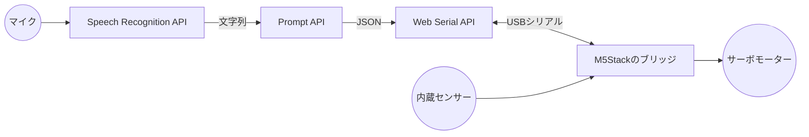

# Webでハードウェアを動かす

ブラウザからUSBでつないだM5Stackを読み書きし、話しかけた言葉でサーボモーターを動かすハンズオンです。
使うのは、ブラウザに組み込まれた3つのWeb標準APIだけです。
アプリのインストールもサーバーも要りません。

- **Speech Recognition API**：マイクの音声を文字列に変換する
- **Prompt API**：ブラウザに組み込まれた言語モデルで、文字列を構造化されたコマンドに変換する
- **Web Serial API**：USBシリアルでつないだ機器とバイト列をやり取りする

## 全体像

ハンズオンでは、データの流れを2つの向きで扱います。
前半は、M5Stackの内蔵センサーの値をブラウザで受け取り、Prompt APIに状態を判断させます。
後半は逆向きに、声で出した指示をPrompt APIでコマンドに変換し、M5Stackに送ってサーボモーターを動かします。



M5Stackには、USBシリアルとセンサーやサーボモーターのあいだを取り次ぐ小さなプログラム（以下、**ブリッジ**）を書き込んでおきます。
ブリッジは、1行のテキストで届いたコマンドを実行し、センサー値や実行結果を1行のJSONで返します。
ブラウザ側のプログラムはこの取り決めだけを知っていればよく、M5Stackの内部のことは知らなくて構いません。

## 進め方

M5Stackの準備は、ハンズオンの前に済ませておきます。
所要時間は、休憩を含めて約5.5時間です。

| 目安時間 | 内容                                                                 |
| -------- | -------------------------------------------------------------------- |
| 事前     | [M5Stackの準備](m5stack-setup.md)                                    |
| 20分     | 導入デモと全体像（このページ）                                       |
| 30分     | [Web Serial APIの基礎](web-serial-api.md)                            |
| 40分     | ハンズオン①：[センサー値をブラウザでモニターする](sensor-monitor.md) |
| 40分     | ハンズオン②：[センサー値をPrompt APIで解説させる](sensor-ai.md)      |
| 60分     | 昼休み                                                               |
| 40分     | ハンズオン③：[サーボモーターを動かす](servo.md)                      |
| 30分     | [Speech Recognition APIの基礎](speech-recognition.md)                |
| 60分     | ハンズオン④：[声でサーボモーターを動かす](voice-servo.md)            |
| 10分     | 休憩                                                                 |
| 40分     | グループワーク                                                       |
| 20分     | まとめと質疑応答                                                     |

## 必要なもの

- M5Stack Core2（UIFlow2とブリッジを書き込み済みのもの）とUSBケーブル
- PCA9685を搭載したサーボドライバーのボードと、Grove端子につなぐケーブル
- マイクロサーボ（SG90など）を2つ使ったアーム
- サーボモーター用の5V電源
- Chrome 148以降が動くPC（[受講環境の事前確認](../prompt-api-setup.md)でPrompt APIの動作を確認済みのもの）
- マイク（PC内蔵のものでよい）

Prompt APIの使い方は [Prompt API入門](../prompt-api.md) を前提にしています。
セッションの作成、`prompt()`、`responseConstraint`による構造化出力に見覚えがなければ、先に目を通してください。

## サンプルの動かし方

各ページのサンプルは、[LiveCodes](https://livecodes.io/) と [StackBlitz](https://stackblitz.com/) でインストールなしに開けます。
ページに埋め込んだ画面にもWeb Serial APIとマイクの使用を許可してありますが、ポートの選択画面が開かないなど動作しない場合は、バッジから別のタブで開いてください。

手元で動かす場合は、リポジトリを取得してサンプルのディレクトリで次のコマンドを実行します。

```bash
npm install
npm start
```

Web Serial APIとマイクは、`https://`か`http://localhost`で配信したページ（安全なコンテキスト）で使う前提のAPIです。
特にSpeech Recognition APIは、HTMLファイルをダブルクリックして`file://`で開くとChromeで動作しません。
どのサンプルも静的サーバーを経由して開きます。
