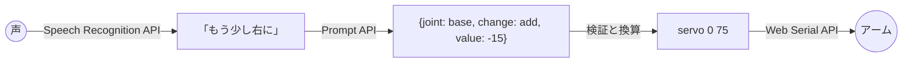

# 声でサーボモーターを動かす

ここまでに扱った3つのAPIをつなぎ、「もう少し右に」「つかんで」と話しかけるだけでアームが動く仕組みを作ります。
音声をSpeech Recognition APIで文字列にし、Prompt APIで関節の動作を表すJSONに変換して、Web Serial APIでM5Stackに送ります。



## サンプル

[](https://github.com/kou029w/intro-to-web-dev/tree/main/examples/voice-servo)
[](https://livecodes.io/?x=https://github.com/kou029w/intro-to-web-dev/tree/main/examples/voice-servo)
[](https://stackblitz.com/github/kou029w/intro-to-web-dev/tree/main/examples/voice-servo?file=script.js&view=preview)

<iframe loading="lazy" allow="serial; microphone; language-model" src="https://livecodes.io/?x=https://github.com/kou029w/intro-to-web-dev/tree/main/examples/voice-servo" style="width:100%; height:680px; border:0; border-radius:0.5rem;"></iframe>

## 関節の設定を書き換える

まず、`script.js`の先頭にある`JOINTS`を、[サーボモーターを動かす](servo.md)で記録した可動範囲に合わせます。

```js
const JOINTS = [
  {
    name: "base",
    channel: 0,
    label: "旋回",
    min: 0,
    max: 180,
    home: 90,
    hint: "値を大きくすると左、小さくすると右を向く。90度が正面",
  },
  {
    name: "grip",
    channel: 1,
    label: "グリッパー",
    min: 40,
    max: 120,
    home: 60,
    hint: "値を大きくすると閉じてつかみ、小さくすると開いて離す",
  },
];
```

`min`と`max`には記録した最小と最大の角度を入れます。
`hint`には、値を大きくしたときの動きを、モデルが読む文章として書きます。
記録したときに「値を大きくすると右を向く」だったなら、`hint`もそのとおりに書き換えます。

## 動かしてみる

最初は、M5Stackを接続せずに試します。
「指示する」の欄に「左を向いて」と入力して送信すると、「処理の流れ」の表に、指示、モデルの出力、送信したコマンドが1行ずつ追加され、「現在の角度」のメーターが動きます。
続けて「もう少し」「つかんで」「正面に戻して離して」と送り、角度がどう変わるかを確かめます。

モデルの出力が期待と違っても、ここではアームは動きません。
意図どおりに動くことを確かめてから、「M5Stackに接続」を押してアームを動かします。

声で指示するときは、「話す」を押してからマイクに向かって話します。
画面に認識した文字列が表示され、話し終えると同じ流れで処理されます。
ページを開いたときの表示で、音声認識を端末内とサーバーのどちらで処理しているかを確認できます。

## 指示を関節の動作に変換する

このページの中心は、自然言語の指示を、プログラムで実行できる形に変換する部分です。
モデルに出力させるJSONの形は、次のスキーマで決めています。

```js
const schema = {
  type: "object",
  properties: {
    actions: {
      type: "array",
      maxItems: 4,
      items: {
        type: "object",
        properties: {
          joint: { type: "string", enum: JOINTS.map((j) => j.name) },
          change: { type: "string", enum: ["set", "add"] },
          value: { type: "integer", minimum: -180, maximum: 180 },
        },
        required: ["joint", "change", "value"],
      },
    },
    reply: { type: "string" },
  },
  required: ["actions", "reply"],
};
```

`actions`は、関節の動作を順に並べた配列です。
「正面に戻して離して」のように1つの指示に複数の動作が含まれる場合は、動作の数だけ要素が並びます。
`reply`は、利用者に返す短い返事です。

### 角度を直接出力させない

1つの動作は、関節の名前（`joint`）、変え方（`change`）、値（`value`）の3つで表します。
`change`が`"set"`なら`value`の角度にし、`"add"`なら現在の角度に`value`を足します。

「もう少し右に」のような相対的な指示を、モデルに「75度」のような絶対的な角度で答えさせることもできます。
しかし、Gemini Nanoのような小型のモデルは、現在の角度から15を引くといった計算を間違えることがあります。
そこで、モデルには「右に15度」という指示の解釈だけを任せ、足し算はコードで行います。
言葉の解釈はモデルに、計算はコードに、という分担です。

### 関節の名前を列挙する

`joint`の`enum`には、`JOINTS`の`name`をそのまま渡しています。
モデルの出力は`"base"`か`"grip"`のどちらかに限られ、存在しない関節の名前が返ることはありません。
チャンネル番号（0や1）ではなく名前を使っているのは、モデルがシステムプロンプトの説明と結び付けやすくするためです。
チャンネル番号への変換は、コードで`JOINTS`を引いて行います。

## モデルに渡す情報

### 関節の説明をシステムプロンプトに入れる

システムプロンプトは、`JOINTS`から組み立てています。

```text
あなたはロボットアームの操作係です。利用者の日本語の指示を、関節の動作の列に変換します。
関節の一覧:
- base（旋回）: 0〜180度。値を大きくすると左、小さくすると右を向く。90度が正面。
- grip（グリッパー）: 40〜120度。値を大きくすると閉じてつかみ、小さくすると開いて離す。
changeが"set"なら角度をvalueにし、"add"なら現在の角度にvalueを足します。
「少し」は15度、程度の指定がなければ30度動かします。
（以下略）
```

「右」「つかむ」のような言葉が、どの関節をどちら向きに動かすことなのかは、アームによって異なります。
モデルはこの対応を知らないため、`hint`に書いた説明を手がかりに変換します。
「少し」を何度とみなすかのような、利用者ごとに解釈が分かれる言葉も、ここで決めておきます。

### 入力と出力の例を示す

システムプロンプトのあとには、指示とそれに対する正しい出力の組を5つ並べています。

```js
{ role: "user", content: "現在の角度: base=120, grip=60\n直前の指示: 左を向いて\n指示: もうちょっと" },
{ role: "assistant", content: '{"actions":[{"joint":"base","change":"add","value":15}],"reply":"もう少し左に向けます"}' },
```

小型のモデルは、規則を文章で説明されるよりも、具体的な例を見せられたほうが意図どおりに出力しやすくなります。
例には、相対的な指示、つかむ指示、複数の動作を含む指示、アームと関係のない指示を1つずつ含めています。
`JOINTS`の名前や範囲を変えたら、例の中の値も合わせて直します。

### 現在の角度と直前の指示を毎回渡す

「もう少し」のような指示を正しく解釈するには、今の角度と、直前に何を指示したかがわからなければなりません。
サンプルでは、指示のたびに元のセッションを`clone()`で複製し、会話の履歴を持たない状態から始めています。
その代わり、現在の角度と直前の指示を、指示の文に毎回書き込みます。

```text
現在の角度: base=90, grip=60
直前の指示: 左を向いて
指示: もうちょっと
```

会話の履歴を1つのセッションに積み重ねていく方法もありますが、指示を重ねるほど履歴が長くなり、応答が遅くなっていきます。
また、角度の正しい値を持っているのはモデルではなくコードです。
コードが持っている現在の角度をそのつど渡せば、モデルが過去のやり取りから角度を推測し損なうことはありません。

## モデルの出力を検証する

スキーマで出力の形を制限しても、モデルの出力をそのままM5Stackに送るわけにはいきません。
スキーマが保証するのは形だけで、値がアームにとって安全かどうかまでは保証しないからです。
たとえばグリッパーが40度から120度までしか動かないのに、`{"joint": "grip", "change": "set", "value": 180}`が返ることは、スキーマに照らせば正しい出力です。

サンプルでは、送信する前に、コードで関節名と角度を検証しています。

```js
function toCommand(action) {
  const joint = JOINTS.find((j) => j.name === action.joint);
  if (!joint || !Number.isInteger(action.value)) return null;
  const target =
    action.change === "add" ? angles[joint.name] + action.value : action.value;
  const angle = Math.min(joint.max, Math.max(joint.min, target));
  return { joint, angle };
}
```

見つからない関節名や整数でない値は、その動作ごと捨てます。
角度は`JOINTS`の`min`と`max`の範囲に丸めます。
その結果、グリッパーに180度を指示する出力が返っても、実際に送られるのは`servo 1 120`です。

安全のための制限は、3か所に重ねてあります。

| 場所             | 制限の内容                                     |
| ---------------- | ---------------------------------------------- |
| スキーマ         | 出力の形、関節名の候補、値の範囲（-180〜180）  |
| ブラウザのコード | アームごとの可動範囲（`JOINTS`の`min`と`max`） |
| ブリッジ         | サーボモーターが受け付ける範囲（0〜180度）     |

どれか1か所に誤りがあっても、ほかの制限がアームを守ります。
モデルの出力を画面に表示するときに`textContent`を使うのと同じく、モデルの出力は信頼できない入力として扱います。

## 指示を順番に処理する

モデルが1つの指示を処理している間に、次の指示が届くことがあります。
2つの指示を同時に処理すると、どちらも同じ「現在の角度」をもとに動作を計算し、あとから届いた指示の結果で先の結果を上書きしてしまいます。
サンプルでは、Promiseをつないだ待ち行列を使い、指示を1つずつ順番に処理しています。

```js
let queue = Promise.resolve();

function handleInstruction(instruction) {
  queue = queue.then(() => run(instruction));
}
```

`run()`の中でも、1つの指示に含まれる複数の動作を、0.4秒ずつ間を空けて順に送っています。
「正面に戻して離して」なら、アームが正面に向き終えてからグリッパーが開きます。

## どこで処理しているか

このサンプルでは、指示を受け取ってからアームが動くまで、ほとんどの処理がブラウザの中で完結しています。

| 処理            | 場所                                               |
| --------------- | -------------------------------------------------- |
| 音声の認識      | 日本語の言語パックがあれば端末内、なければサーバー |
| 指示の解釈      | 端末内（Gemini Nano）                              |
| 検証と換算      | 端末内（JavaScript）                               |
| M5Stackとの通信 | 端末内（USBシリアル）                              |

ページとモデルを読み込んだあとなら、テキスト入力欄から指示する場合と、日本語の言語パックで音声を端末内で認識できる場合は、ネットワークを切断してもアームを操作できます。
アプリのインストールもサーバーも使わずに、ブラウザだけでここまでの処理を組み立てられることが、Web標準APIで機器を扱う利点です。

## グループワーク

グループで1つの課題を選び、サンプルを改造してみましょう。

- **つかんで運ぶ**：「右にあるものを左に運んで」と話しかけると、右を向く、つかむ、左を向く、離す、の4つの動作を順に行うようにします。例を追加すると、モデルが意図どおりの動作列を返しやすくなります。
- **緊急停止**：「止まって」「ストップ」と言ったら、モデルを通さずにすぐ`release`を送るようにします。確実に動いてほしい指示を、モデルの解釈に任せるべきかどうかを考えてみましょう。
- **返事を声で返す**：`reply`の文章を、Speech Synthesis API（`speechSynthesis.speak()`）で読み上げます。
- **ゆっくり動かす**：「ゆっくり」と指示されたら、1度ずつ時間をかけて目標の角度に近づけます。速さを表す項目をスキーマに加えるところから考えます。
- **センサーと組み合わせる**：M5Stackを傾けた向きにアームを向け、「そのまま」と言うまで追いかけ続けるようにします。

## まとめ

- Speech Recognition APIで音声を文字列に、Prompt APIで文字列をJSONに、Web Serial APIでJSONから作ったコマンドを機器に送る
- モデルには言葉の解釈を任せ、角度の計算や範囲の確認はコードで行う
- スキーマの`enum`で、関節名のような選択肢をモデルの出力の段階で限定する
- モデルに渡す指示には、コードが持っている現在の状態を毎回書き込む
- モデルの出力は信頼できない入力として扱い、機器に送る前に検証する
