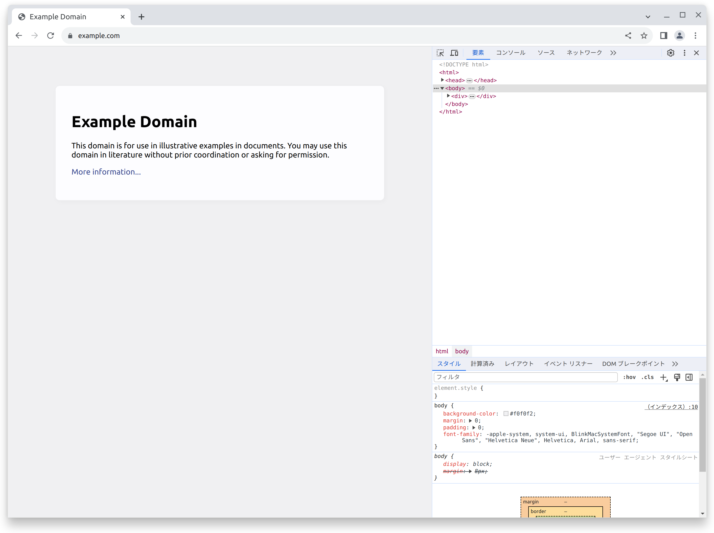
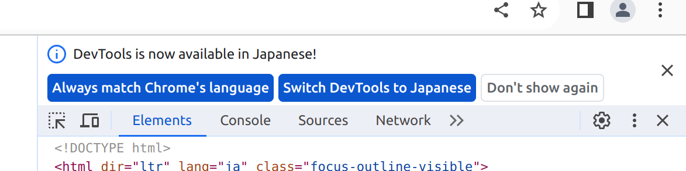
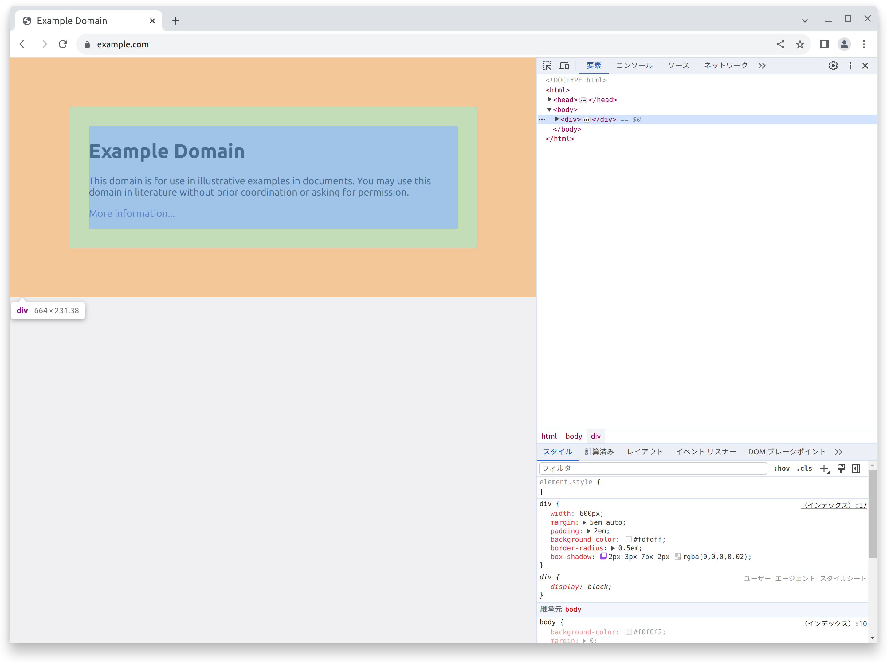
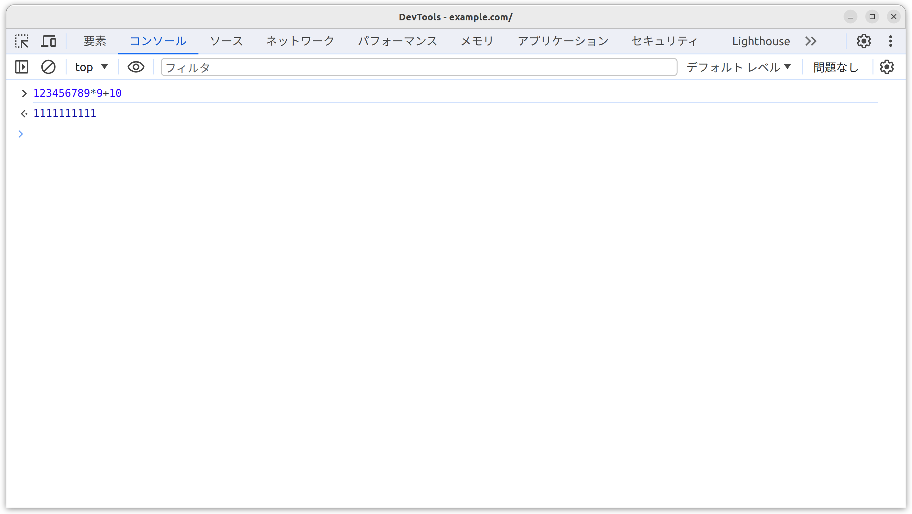
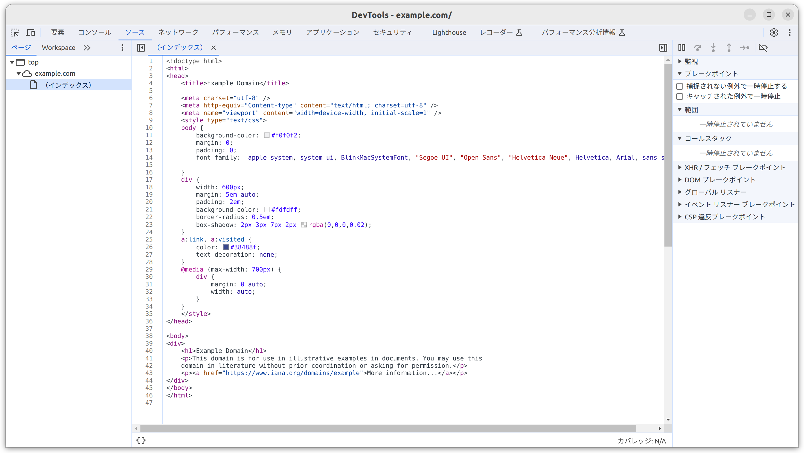
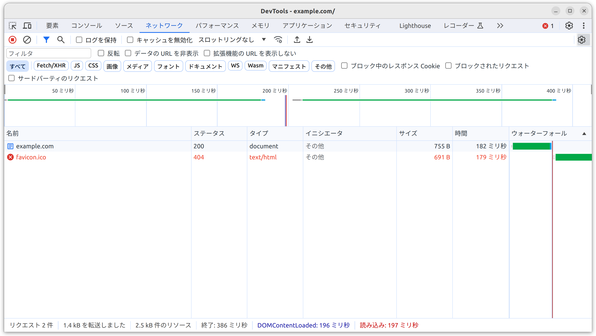
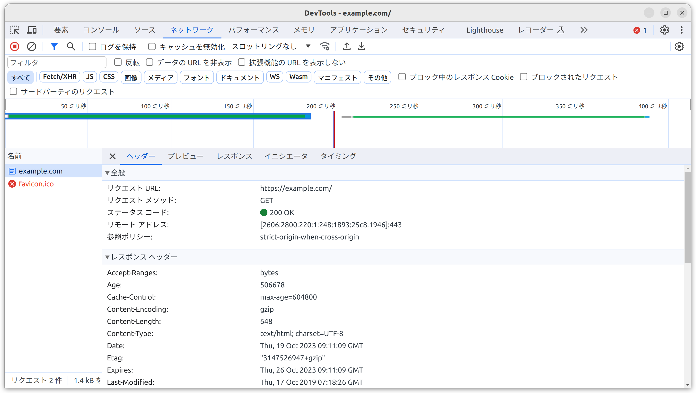
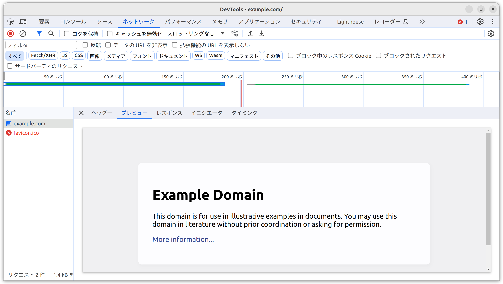
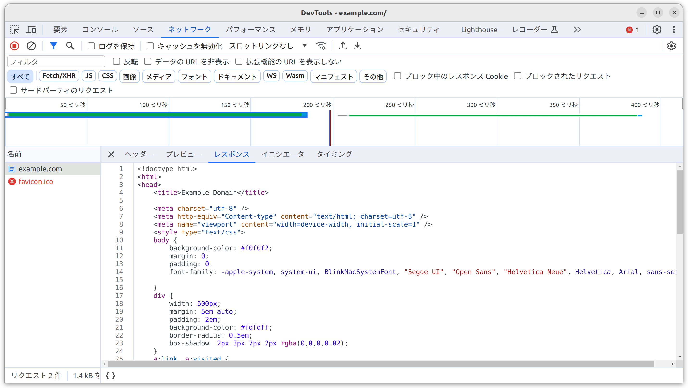

# 開発者ツールに慣れる

Webブラウザーには開発者ツールが内蔵されています。
これを使うことでWebブラウザーが表示しているHTMLの状態を調べたり、どのリソース (URL) に、どのようにアクセスしているのか (HTTPメッセージの内容) 知ることができます。

ここではGoogle ChromeやMicrosoft EdgeなどChromium系ブラウザーの開発者ツールの基本的な使い方を説明します。

## 開発者ツールの起動方法

開発者ツールを起動するにはいくつかの方法があります。

- 右クリック > [検証] を選択
- [その他のツール] > [デベロッパー ツール] を選択
- Windows/Linuxの場合: `Ctrl`+`Shift`+`I`
- macOSの場合: `⌘ (Command)`+`⌥ (Option)`+`I`

どの方法でもOKです。

> **Note**\
> 開発者ツールの翻訳
>
> 
>
> はじめて開発者ツールを起動したとき、メニューがすべて英語で表示されることがあります。
> 開発者ツールのメニューを翻訳するには開発者ツール上部の [Always match Chrome's language] を選択しましょう。

実際に手元のWebブラウザーから開発者ツールを起動してみましょう。

## 要素 (Elements)

画面上に表示されているHTML要素とその状態を知ること、一時的に編集することができます。

## コンソール (Console)

JavaScriptの実行と、エラーメッセージなど実行しているコードを解析するための情報を知ることができます。

## ソース (Sources)

実行しているコードの表示と一時停止 (ブレークポイントの設定)、そのコードを解析することができます。

## ネットワーク (Network)

WebブラウザーがアクセスしているURLとそのHTTPメッセージの内容知ることができます。

- 上側のペイン: タイムライン
- 左側のペイン: リクエストの一覧
- 右側のペイン: (リクエストの一覧から選択) リクエストヘッダー・プレビュー・レスポンスなどHTTPメッセージの詳細

### ヘッダー

URLとリクエストのメソッド、レスポンスのステータスコードなどHTTPメッセージの基本的な情報を知ることができます。

### プレビュー

(表示可能であれば) そのコンテンツを表示します。

### レスポンス

そのコンテンツの生のデータを表示します。

## ポイント

- 開発者ツール … Webブラウザーが表示しているHTMLの状態を調べたり、どのリソースに、どのようにアクセスしているのか知ることができる

## やってみよう！

- 実際に手元のWebブラウザーで開発者ツールを起動していくつかのWebページにアクセスしてみよう
  - 例: <https://example.com/>
