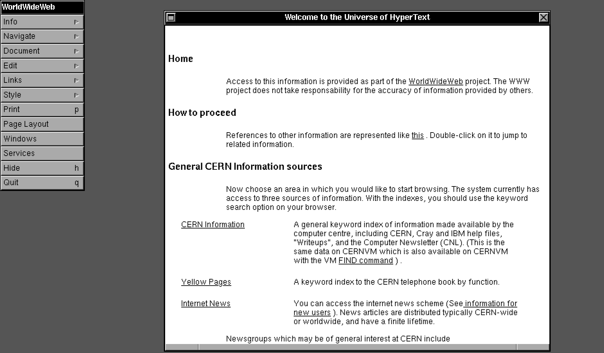
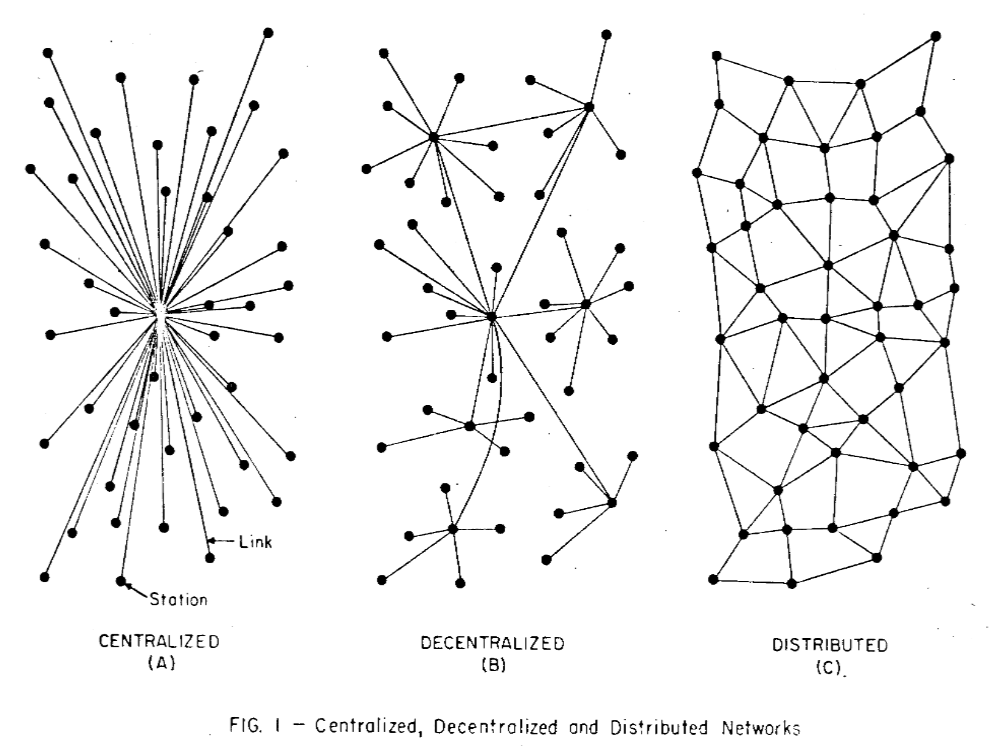

# Webとは

> _"This is for everyone"_
>
> _― [Tim Berners-Lee (@timberners_lee)](https://twitter.com/timberners_lee/status/228960085672599552)_

Webは情報共有とコミュニケーションのためのプラットフォームです。
Web上ではソーシャルメディア、ビデオストリーミング、オンラインショッピングなど様々な活動が行われます。(便利ですよね。)

## World Wide Web

_― 画像: <https://worldwideweb.cern.ch/browser/> より_

これは世界初のWebブラウザー[WorldWideWeb](https://ja.wikipedia.org/wiki/WorldWideWeb)の画像です。

普段使っているブラウザーからでも世界最初のWebサイトにアクセスすることができます。

https://info.cern.ch/hypertext/WWW/TheProject.html

World Wide Web (Web) は、1989年に[分散型ハイパーテキストシステム (distributed hypertext system)](https://www.w3.org/History/1989/proposal.html)としてティム・バーナーズ・リーによって提案されたアイデアが元になっています。世界中に張り巡らされた蜘蛛の巣を連想して名付けられました。

> **Note**\
> 中央集権型 (centralized) と 非中央集権型 (decentralized) と 分散型 (distributed)
>
> > \
> > _― 画像: ポール・バラン (1964) [On Distributed Communications Networks](https://www.rand.org/content/dam/rand/pubs/papers/2005/P2626.pdf) より_
>
> Webは分散型のシステムです。中央集権型のシステムではありません。Web上で何か活動するとき、中央の機関からの許諾は一切必要ありません。いつでも、どこでも、誰でも自由に使うことができます。

## Webブラウザー

Webブラウザーは、Webページの取得・描画を行うソフトウェアです。

代表的なWebブラウザーとしては、[Google Chrome](https://www.google.co.jp/intl/ja/chrome/)、[Safari](https://www.apple.com/jp/safari/)、[Mozilla Firefox](https://www.mozilla.org/ja/firefox/)、[Microsoft Edge](https://www.microsoft.com/ja-jp/edge)などが挙げられます。

## Webの標準化

主に3つの標準化団体が関わっています。

- [IETF (Internet Engineering Task Force)](https://www.ietf.org/)
- [W3C (The World Wide Web Consortium)](https://www.w3.org/)
- [WHATWG (Web Hypertext Application Technology Working Group)](https://whatwg.org/)

IETFはインターネットに関する全般的な技術、約束事、コミュニティで共有すべき事柄の管理を担っています。それらは [RFC (Request for Comments)](https://ja.wikipedia.org/wiki/Request_for_Comments) と呼ばれる形式で記録されています。

W3CとWHATWGはWebに関する仕様の管理を担っています。具体的にはW3Cは[CSS](https://developer.mozilla.org/ja/docs/Web/CSS)など、WHATWGは[HTML](https://developer.mozilla.org/ja/docs/Web/HTML)関連の仕様などを発行しています。
WHATWGの発行している仕様はIETFやW3Cの仕様とは異なり内容が確定することはありません。[HTML Living Standard](https://html.spec.whatwg.org/multipage/)はその時点が常に最新版の標準仕様となっており、継続的に更新され続けています。

いずれの仕様もWeb上で公開されており、無償で閲覧可能、誰でも参加可能、自由に実装可能です。

## ポイント

- Web … 分散型ハイパーテキストシステム
- Webブラウザー … Webページの取得・描画を行うソフトウェア
- Webの標準化 … 無償で閲覧可能、誰でも参加可能、自由に実装可能
